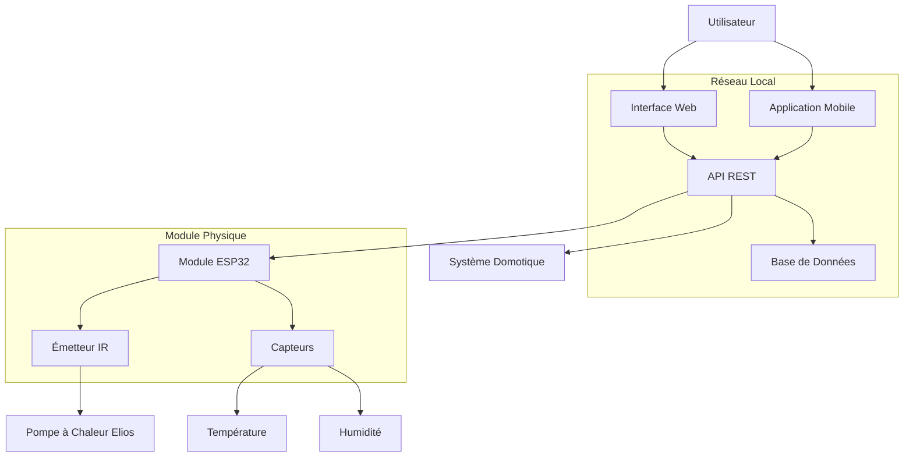

# Thermopompe - Contrôle Domotique IR

[](https://github.com) [](LICENSE)

## Description

Système de contrôle domotique pour remplacer la télécommande d'une pompe à chaleur Elios (modèle DE12HIW23230E3) par un module électronique connecté utilisant la technologie infrarouge (IR). Ce projet permet l'automatisation complète du chauffage et du refroidissement via une interface web moderne et une API REST.

## Fonctionnalités

- ✅ Contrôle infrarouge de la pompe à chaleur Elios DE12HIW23230E3
- ✅ Interface web responsive
- ✅ API REST complète
- ✅ Automatisation programmable (horaires, scénarios)
- ✅ Commandes silencieuses (sans bip)
- 🔄 Intégration domotique (Home Assistant, etc.)
- 🔄 Surveillance température et humidité
- 🔄 Application mobile

## Spécifications Matériel

### Pompe à Chaleur Compatible
- **Fabricant** : Elios
- **Modèle (unité intérieure)** : DE12HIW23230E3
- **Contrôle** : Télécommande infrarouge standard

### Astuces Techniques
- **Power On** = produit un bruit BIP (à éviter)
- **Timer On** (2 pressions) = démarre dans 30 minutes sans bruit
- **Bouton LED** = désactive les notifications sonores

## Besoins d'Automatisation

Le système répond aux besoins suivants :
- **Chauffage hivernal automatisé** :
  - Fermeture nocturne pour économies d'énergie
  - Réouverture matinale avant le réveil
  - Réduction pendant les heures de jour
- **Programmation avancée** selon les habitudes de vie
- **Contrôle à distance** via smartphone/ordinateur
- **Intégration** avec systèmes domotiques existants

## Installation Rapide

```bash
# Installation détaillée disponible dans la documentation
git clone https://github.com/votre-username/thermopompe.git
cd thermopompe
# Suivre le guide d'installation complet
```

📖 **[Guide d'installation détaillé](docs/guide-utilisateur/installation.md)**

## Documentation

### Guide Utilisateur
- 📖 [Installation](docs/guide-utilisateur/installation.md)
- ⚙️ [Configuration](docs/guide-utilisateur/configuration.md)
- 🎯 [Utilisation](docs/guide-utilisateur/utilisation.md)
- 🔧 [Dépannage](docs/guide-utilisateur/depannage.md)

### Documentation Technique
- 🏗️ [Architecture du système](docs/guide-technique/architecture-systeme.md)
- 🔌 [Guide matériel](docs/guide-technique/guide-materiel.md)
- 📡 [API REST](docs/guide-technique/api.md)
- 🔗 [Protocoles de communication](docs/guide-technique/protocoles.md)

### Ressources
- ❓ [Questions fréquentes](docs/ressources/faq.md)
- 📚 [Glossaire technique](docs/ressources/glossaire.md)
- 🔗 [Références externes](docs/ressources/references.md)

## Architecture



## État du Projet

🔨 **En développement actif**

### Roadmap
- [ ] **Phase 1** : Contrôle IR de base
- [ ] **Phase 2** : Interface web
- [ ] **Phase 3** : API REST et intégrations
- [ ] **Phase 4** : Application mobile
- [ ] **Phase 5** : Fonctionnalités avancées

## Contribution

Les contributions sont les bienvenues ! Consultez notre [guide de contribution](CONTRIBUTING.md) pour commencer.

### Comment Contribuer
1. Fork du projet
2. Création d'une branche feature (`git checkout -b feature/nouvelle-fonctionnalite`)
3. Commit des modifications (`git commit -am 'Ajout nouvelle fonctionnalité'`)
4. Push vers la branche (`git push origin feature/nouvelle-fonctionnalite`)
5. Création d'une Pull Request

## Support

- 📧 **Email** : [votre-email@domain.com](mailto:votre-email@domain.com)
- 💬 **Discussions** : [GitHub Discussions](https://github.com/votre-username/thermopompe/discussions)
- 🐛 **Signaler un bug** : [GitHub Issues](https://github.com/votre-username/thermopompe/issues)

## Licence

Ce projet est sous licence MIT. Voir le fichier [LICENSE](LICENSE) pour plus de détails.

---

**Développé avec ❤️ pour l'automatisation domestique**