# Architecture du Système - Thermopompe

## Vue d'Ensemble

Le système de contrôle domotique Thermopompe est conçu comme une architecture modulaire composée de plusieurs couches interconnectées. Cette architecture permet un contrôle flexible, évolutif et maintenable de la pompe à chaleur Elios via des technologies modernes.

## Prérequis

- Compréhension des bases de l'IoT (Internet des Objets)
- Connaissances en réseaux WiFi domestiques
- Familiarité avec les API REST
- Notions de base en électronique

## Architecture Globale

### Diagramme d'Architecture Système

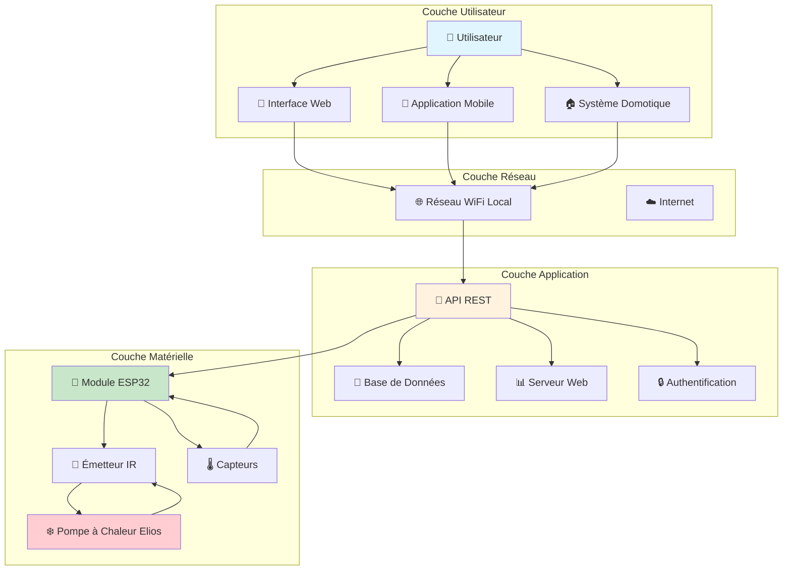

### Composants Principaux

#### 1. Couche Utilisateur
- **Interface Web** : Application web responsive accessible via navigateur
- **Application Mobile** : App native pour contrôle nomade
- **Système Domotique** : Intégration avec Home Assistant, OpenHAB, etc.

#### 2. Couche Application
- **API REST** : Interface de programmation standardisée
- **Base de Données** : Stockage des configurations et historiques
- **Serveur Web** : Distribution de l'interface utilisateur
- **Authentification** : Sécurisation des accès

#### 3. Couche Matérielle
- **Module ESP32** : Microcontrôleur principal avec WiFi
- **Émetteur IR** : Module infrarouge pour communication avec la pompe
- **Capteurs** : Température, humidité, luminosité
- **Pompe à Chaleur** : Appareil Elios DE12HIW23230E3

## Flux de Données

### Diagramme de Séquence - Contrôle de Température

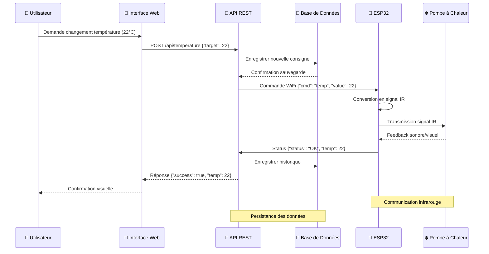

### Diagramme de Flux - Surveillance Continue

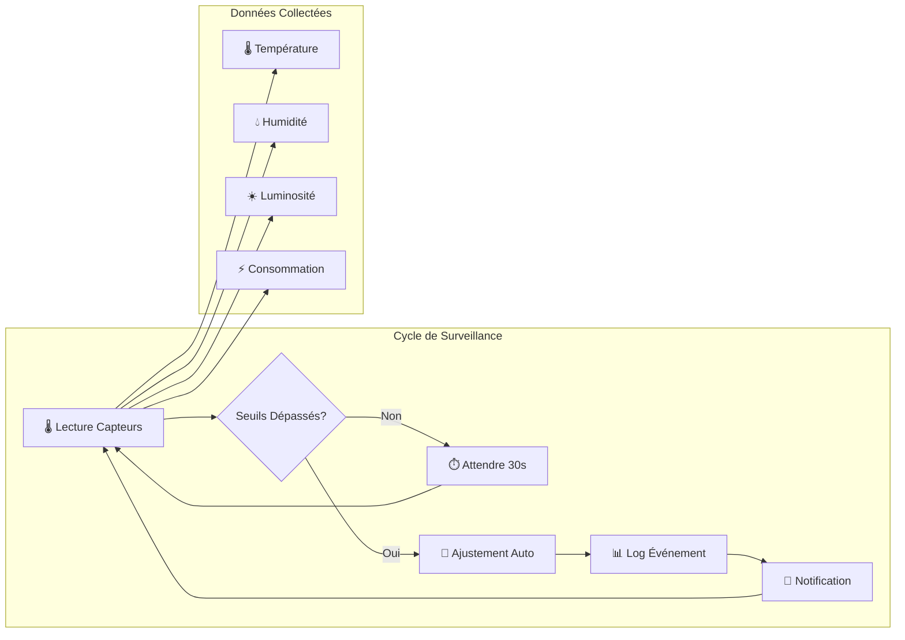

## Architecture Logicielle

### Structure du Code ESP32

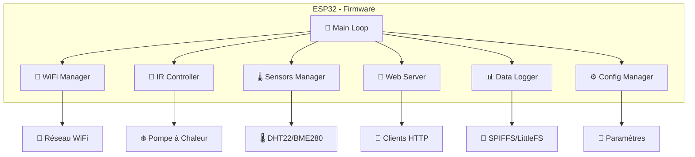

### Architecture API REST

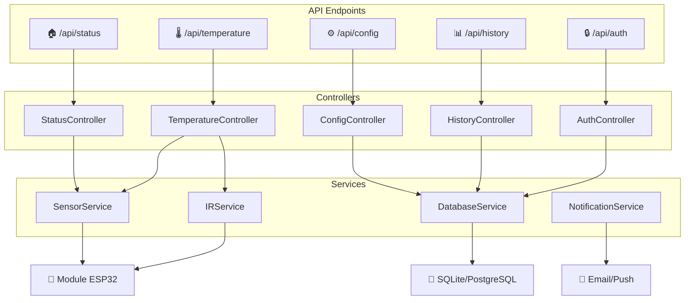

## Protocoles de Communication

### Communication WiFi

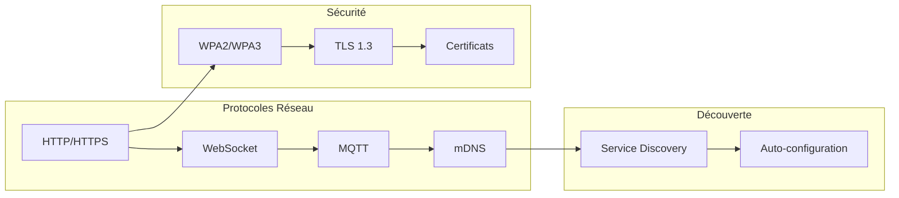

### Protocole Infrarouge

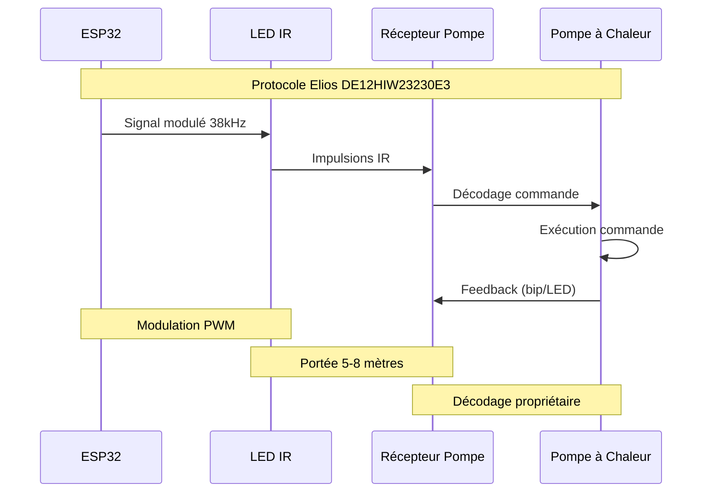

## États du Système

### Machine d'État Principale

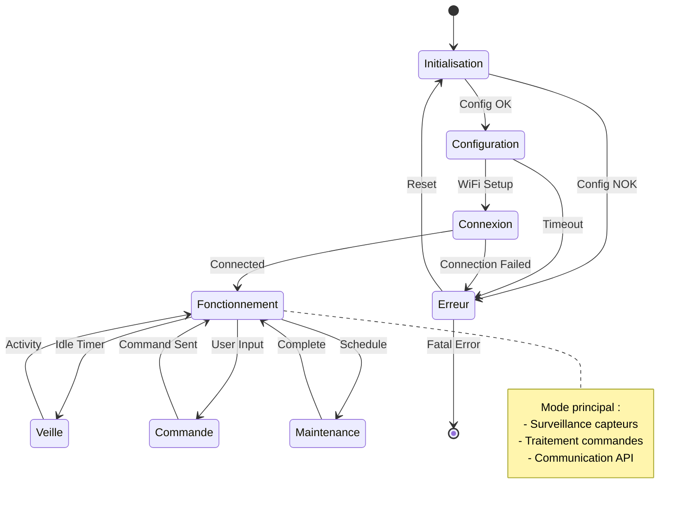

### États de la Pompe à Chaleur

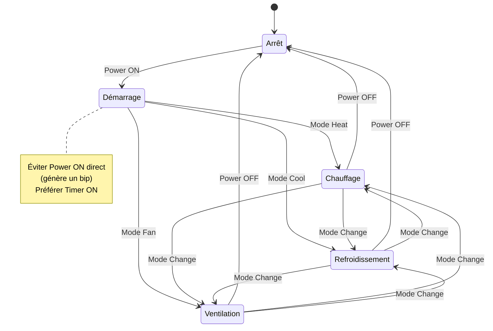

## Sécurité et Authentification

### Modèle de Sécurité

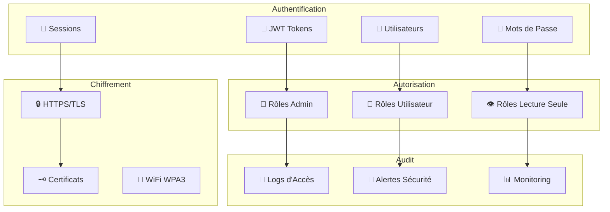

## Performance et Scalabilité

### Métriques de Performance

| Composant | Métrique | Valeur Cible | Unité |
|-----------|----------|---------------|-------|
| ESP32 | Latence commande | < 100 | ms |
| API REST | Temps de réponse | < 200 | ms |
| Interface Web | Chargement page | < 2 | secondes |
| Base de données | Requête simple | < 50 | ms |
| WiFi | Portée effective | 20+ | mètres |
| IR | Portée émission | 8+ | mètres |

### Optimisations

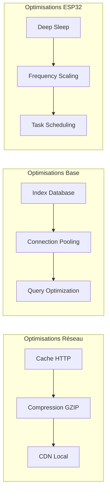

## Dépannage Architecture

### Problèmes Courants

**Problème : Perte de connexion WiFi**
- **Symptômes** : ESP32 non accessible via réseau
- **Diagnostic** : Vérifier signal WiFi, configuration réseau
- **Solution** : Reconnexion automatique, mode AP de secours

**Problème : Commandes IR ignorées**
- **Symptômes** : Pompe ne répond pas aux commandes
- **Diagnostic** : Vérifier alignement IR, portée, obstacles
- **Solution** : Réajuster position, vérifier LED IR

**Problème : Latence élevée**
- **Symptômes** : Délai important entre commande et exécution
- **Diagnostic** : Vérifier charge réseau, performance ESP32
- **Solution** : Optimiser code, réduire fréquence de surveillance

## Évolutions Futures

### Roadmap Architecture

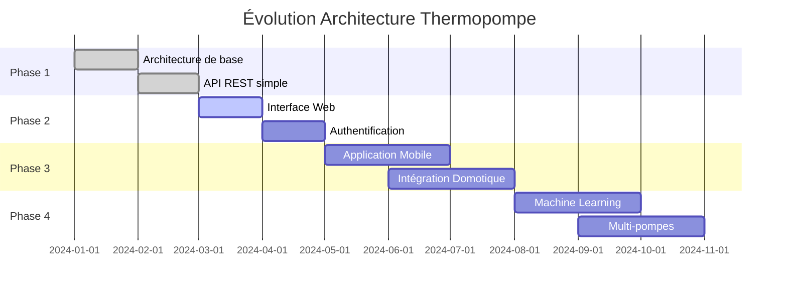

### Technologies Émergentes

- **Intelligence Artificielle** : Optimisation automatique basée sur l'usage
- **Edge Computing** : Traitement local avancé
- **Mesh Networks** : Réseau maillé pour installations multiples
- **Blockchain** : Sécurité décentralisée (pour installations commerciales)

## Références


documentation/esp32_technical_reference_manual_en.pdf)
- [IRremoteESP8266 Library](https://github.com/crankyoldgit/IRremoteESP8266)
- [AsyncWebServer Documentation](https://github.com/me-no-dev/ESPAsyncWebServer)
- [ArduinoJson Library](https://arduinojson.org/)

---

## Architecture Logicielle Détaillée

### Vue d'Ensemble de l'Architecture Logicielle

L'architecture logicielle du système suit un pattern en couches avec séparation claire des responsabilités. Chaque couche a un rôle spécifique et communique avec les couches adjacentes via des interfaces bien définies.

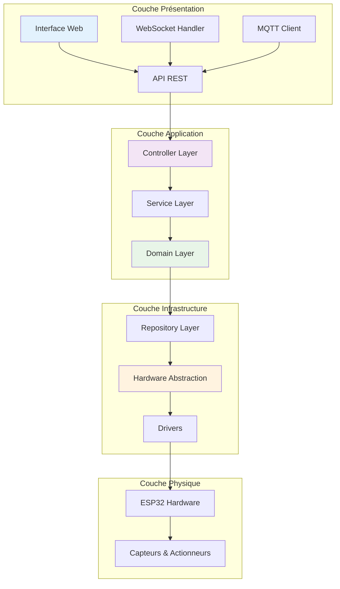

### Architecture des Composants Logiciels

#### 1. Gestionnaire Principal (Main Controller)

```cpp
// Structure du gestionnaire principal
class MainController {
private:
    WiFiManager wifiManager;
    WebServerManager webServer;
    IRController irController;
    SensorManager sensorManager;
    ConfigManager configManager;
    LogManager logManager;
    
    SystemState currentState;
    TaskScheduler scheduler;
    
public:
    void setup();
    void loop();
    void handleSystemEvents();
    void updateSystemState();
};

// Boucle principale optimisée
void MainController::loop() {
    // Traitement des tâches par priorité
    scheduler.executePendingTasks();
    
    // Gestion des connexions réseau
    wifiManager.maintainConnection();
    
    // Traitement des requêtes web
    webServer.handleClients();
    
    // Lecture des capteurs (non-bloquant)
    if (scheduler.isTimeFor(SENSOR_READ_INTERVAL)) {
        sensorManager.readSensorsAsync();
    }
    
    // Surveillance système
    if (scheduler.isTimeFor(HEALTH_CHECK_INTERVAL)) {
        performHealthCheck();
    }
    
    // Gestion de l'alimentation
    powerManager.optimizePowerConsumption();
}
```

#### 2. Gestionnaire de Tâches (Task Scheduler)

```cpp
// Système de planification des tâches
class TaskScheduler {
public:
    enum TaskPriority {
        CRITICAL = 0,    // Sécurité, communication IR
        HIGH = 1,        // Réponses API, WebSocket
        MEDIUM = 2,      // Lecture capteurs, logs
        LOW = 3          // Maintenance, nettoyage
    };
    
private:
    struct Task {
        uint32_t id;
        TaskPriority priority;
        uint32_t nextExecution;
        uint32_t interval;
        std::function<void()> callback;
        bool enabled;
    };
    
    std::vector<Task> tasks;
    uint32_t nextTaskId;
    
public:
    uint32_t addTask(TaskPriority priority, uint32_t interval, 
                     std::function<void()> callback);
    void removeTask(uint32_t taskId);
    void executePendingTasks();
    bool isTimeFor(uint32_t interval);
};

// Exemple d'utilisation
void setupTasks() {
    // Tâche critique : surveillance IR
    scheduler.addTask(TaskScheduler::CRITICAL, 100, []() {
        irController.processQueue();
    });
    
    // Tâche haute priorité : traitement WebSocket
    scheduler.addTask(TaskScheduler::HIGH, 50, []() {
        webSocket.processMessages();
    });
    
    // Tâche moyenne : lecture capteurs
    scheduler.addTask(TaskScheduler::MEDIUM, 30000, []() {
        sensorManager.updateReadings();
    });
}
```

#### 3. Gestionnaire de Configuration (Config Manager)

```cpp
// Gestionnaire de configuration centralisé
class ConfigManager {
private:
    struct SystemConfig {
        // Configuration réseau
        char wifi_ssid[32];
        char wifi_password[64];
        char device_name[32];
        bool auto_discovery;
        
        // Configuration IR
        uint8_t ir_pin;
        uint16_t ir_frequency;
        uint8_t retry_count;
        uint16_t retry_delay;
        
        // Configuration capteurs
        uint8_t temp_sensor_pin;
        uint16_t sensor_read_interval;
        float temp_calibration_offset;
        
        // Configuration sécurité
        char jwt_secret[64];
        uint32_t session_timeout;
        bool https_enabled;
        
        // Checksum pour validation
        uint32_t checksum;
    };
    
    SystemConfig config;
    bool configLoaded;
    
public:
    bool loadConfiguration();
    bool saveConfiguration();
    void resetToDefaults();
    bool validateConfiguration();
    
    // Getters/Setters typés
    const char* getWiFiSSID() const { return config.wifi_ssid; }
    void setWiFiSSID(const char* ssid);
    
    uint8_t getIRPin() const { return config.ir_pin; }
    void setIRPin(uint8_t pin);
};
```

#### 4. Gestionnaire de Capteurs (Sensor Manager)

```cpp
// Interface générique pour capteurs
class SensorInterface {
public:
    virtual bool initialize() = 0;
    virtual bool readData() = 0;
    virtual bool isConnected() = 0;
    virtual String getLastError() = 0;
};

// Gestionnaire de capteurs avec agrégation
class SensorManager {
private:
    std::vector<std::unique_ptr<SensorInterface>> sensors;
    SensorData aggregatedData;
    uint32_t lastUpdate;
    
public:
    void addSensor(std::unique_ptr<SensorInterface> sensor);
    void readSensorsAsync();
    SensorData getAggregatedData() const;
    bool areSensorsHealthy() const;
    
    // Calibration automatique
    void performCalibration();
    void applyCalibrationOffset(float offset);
};
```

#### 5. Gestionnaire IR Avancé (IR Controller)

```cpp
// Gestionnaire IR avec file d'attente et retry intelligent
class IRController {
private:
    struct IRCommand {
        uint32_t code;
        uint8_t priority;
        uint32_t timestamp;
        uint8_t retryCount;
        std::function<void(bool)> callback;
    };
    
    std::queue<IRCommand> commandQueue;
    AdaptiveRetry retryManager;
    IRTransmitter transmitter;
    bool isTransmitting;
    
public:
    enum CommandPriority {
        EMERGENCY = 0,   // Arrêt d'urgence
        CRITICAL = 1,    // Commandes sécurité
        NORMAL = 2,      // Commandes utilisateur
        BACKGROUND = 3   // Optimisations auto
    };
    
    bool queueCommand(uint32_t irCode, CommandPriority priority, 
                     std::function<void(bool)> callback = nullptr);
    void processQueue();
    bool sendCommandImmediate(uint32_t irCode);
    
    // Statistiques et monitoring
    IRStats getStatistics() const;
    void resetStatistics();
};
```

#### 6. Gestionnaire Web Asynchrone (Web Server Manager)

```cpp
// Serveur web asynchrone avec gestion avancée des sessions
class WebServerManager {
private:
    AsyncWebServer server;
    AsyncWebSocket webSocket;
    SessionManager sessionManager;
    RateLimiter rateLimiter;
    
public:
    void setupRoutes();
    void setupWebSocket();
    void setupSecurity();
    void handleClients();
    
private:
    void handleAPIRequest(AsyncWebServerRequest* request);
    void handleWebSocketMessage(AsyncWebSocketClient* client, 
                               AwsEventType type, void* arg, 
                               uint8_t* data, size_t len);
    bool authenticateRequest(AsyncWebServerRequest* request);
};

// Configuration sécurisée des routes
void WebServerManager::setupRoutes() {
    // Middleware d'authentification
    server.addHandler(new AuthenticationFilter("/api/", sessionManager));
    
    // Middleware de rate limiting
    server.addHandler(new RateLimitFilter(rateLimiter));
    
    // Routes API RESTful
    server.on("/api/v1/status", HTTP_GET, [this](AsyncWebServerRequest* request) {
        handleAPIRequest(request);
    });
    
    // Serveur de fichiers statiques avec cache
    server.serveStatic("/", SPIFFS, "/www/")
          .setDefaultFile("index.html")
          .setCacheControl("max-age=86400");
}
```

### Patterns de Conception Utilisés

#### 1. Observer Pattern pour les Événements

```cpp
// Système d'événements décentralisé
class EventBus {
private:
    std::map<String, std::vector<std::function<void(const Event&)>>> listeners;
    
public:
    void subscribe(const String& eventType, std::function<void(const Event&)> callback);
    void publish(const Event& event);
    void unsubscribe(const String& eventType);
};

// Utilisation pour la communication entre composants
eventBus.subscribe("temperature_changed", [](const Event& e) {
    LOG_INFO("Sensor", "Nouvelle température: " + e.getData());
    webSocket.broadcast(e.toJSON());
});

eventBus.subscribe("ir_command_sent", [](const Event& e) {
    metrics.recordIRCommand(e.getBool("success"));
});
```

#### 2. Strategy Pattern pour les Protocoles

```cpp
// Interface pour stratégies de communication
class CommunicationStrategy {
public:
    virtual bool sendCommand(const Command& cmd) = 0;
    virtual bool isAvailable() = 0;
    virtual String getName() = 0;
};

// Implémentations spécifiques
class IRStrategy : public CommunicationStrategy {
public:
    bool sendCommand(const Command& cmd) override {
        return irController.sendCommand(cmd.getIRCode());
    }
};

class MQTTStrategy : public CommunicationStrategy {
public:
    bool sendCommand(const Command& cmd) override {
        return mqttClient.publish(cmd.getTopic(), cmd.getPayload());
    }
};

// Gestionnaire avec sélection automatique
class CommunicationManager {
private:
    std::vector<std::unique_ptr<CommunicationStrategy>> strategies;
    
public:
    bool sendCommand(const Command& cmd) {
        for (auto& strategy : strategies) {
            if (strategy->isAvailable()) {
                return strategy->sendCommand(cmd);
            }
        }
        return false;
    }
};
```

#### 3. Factory Pattern pour les Capteurs

```cpp
// Factory pour création dynamique de capteurs
class SensorFactory {
public:
    static std::unique_ptr<SensorInterface> createSensor(const String& type, const JsonObject& config) {
        if (type == "DHT22") {
            return std::make_unique<DHT22Sensor>(config["pin"]);
        } else if (type == "BME280") {
            return std::make_unique<BME280Sensor>(config["address"]);
        } else if (type == "DS18B20") {
            return std::make_unique<DS18B20Sensor>(config["pin"]);
        }
        return nullptr;
    }
};

// Configuration dynamique depuis JSON
void configureSensors(const JsonArray& sensorConfigs) {
    for (const auto& config : sensorConfigs) {
        auto sensor = SensorFactory::createSensor(config["type"], config);
        if (sensor && sensor->initialize()) {
            sensorManager.addSensor(std::move(sensor));
        }
    }
}
```

### Gestion Mémoire et Performance

#### 1. Pool d'Objets pour Éviter les Allocations

```cpp
// Pool d'objets pour réduire la fragmentation mémoire
template<typename T, size_t PoolSize>
class ObjectPool {
private:
    std::array<T, PoolSize> objects;
    std::stack<T*> available;
    std::mutex poolMutex;
    
public:
    ObjectPool() {
        for (auto& obj : objects) {
            available.push(&obj);
        }
    }
    
    T* acquire() {
        std::lock_guard<std::mutex> lock(poolMutex);
        if (available.empty()) return nullptr;
        
        T* obj = available.top();
        available.pop();
        return obj;
    }
    
    void release(T* obj) {
        std::lock_guard<std::mutex> lock(poolMutex);
        if (obj) {
            obj->reset(); // Méthode de nettoyage
            available.push(obj);
        }
    }
};

// Utilisation pour les messages réseau
ObjectPool<HTTPResponse, 10> responsePool;
ObjectPool<WebSocketMessage, 20> messagePool;
```

#### 2. Gestion Intelligente de la Mémoire

```cpp
// Gestionnaire de mémoire avec surveillance
class MemoryManager {
private:
    size_t lowMemoryThreshold;
    size_t criticalMemoryThreshold;
    bool lowMemoryMode;
    
public:
    void checkMemoryStatus() {
        size_t freeHeap = ESP.getFreeHeap();
        
        if (freeHeap < criticalMemoryThreshold) {
            // Mode urgence : libération aggressive
            performEmergencyCleanup();
            LOG_ERROR("Memory", "Mémoire critique: " + String(freeHeap));
        } else if (freeHeap < lowMemoryThreshold && !lowMemoryMode) {
            // Mode économie : réduction des fonctionnalités
            enterLowMemoryMode();
            LOG_WARNING("Memory", "Mémoire faible: " + String(freeHeap));
        } else if (freeHeap > lowMemoryThreshold * 1.5 && lowMemoryMode) {
            // Sortie du mode économie
            exitLowMemoryMode();
            LOG_INFO("Memory", "Mémoire restaurée: " + String(freeHeap));
        }
    }
    
private:
    void performEmergencyCleanup() {
        // Nettoyage des caches
        logManager.clearOldLogs();
        webServer.clearSessionCache();
        sensorManager.clearHistoryData();
        
        // Désactivation temporaire de fonctionnalités non essentielles
        webSocket.disconnectNonEssentialClients();
    }
- [ESP32 Technical Reference Manual](https://www.espressif.com/sites/default/files/
    }
};
```

### Système de Tests et Validation

#### 1. Tests Unitaires Intégrés

```cpp
// Framework de tests léger pour ESP32
class TestFramework {
private:
    struct TestResult {
        String testName;
        bool passed;
        String errorMessage;
        uint32_t executionTime;
    };
    
    std::vector<TestResult> results;
    
public:
    void runTest(const String& name, std::function<bool()> test) {
        uint32_t startTime = millis();
        bool passed = false;
        String error = "";
        
        try {
            passed = test();
        } catch (const std::exception& e) {
            error = e.what();
        }
        
        results.push_back({
            name, passed, error, millis() - startTime
        });
    }
    
    void printResults() {
        int passed = 0;
        for (const auto& result : results) {
            Serial.printf("[%s] %s (%dms)\n", 
                result.passed ? "PASS" : "FAIL",
                result.testName.c_str(),
                result.executionTime);
            if (!result.passed && !result.errorMessage.isEmpty()) {
                Serial.printf("  Error: %s\n", result.errorMessage.c_str());
            }
            if (result.passed) passed++;
        }
        Serial.printf("\nTests: %d/%d passed\n", passed, results.size());
    }
};

// Exemples de tests système
void runSystemTests() {
    TestFramework tests;
    
    tests.runTest("WiFi Connection", []() {
        return WiFi.status() == WL_CONNECTED;
    });
    
    tests.runTest("IR Transmission", []() {
        return irController.testTransmission();
    });
    
    tests.runTest("Sensor Reading", []() {
        return sensorManager.areSensorsHealthy();
    });
    
    tests.runTest("API Response", []() {
        return webServer.testAPIEndpoint("/status");
    });
    
    tests.printResults();
}
```

#### 2. Tests d'Intégration Automatisés

```cpp
// Tests d'intégration avec simulation
class IntegrationTester {
private:
    SystemMock mockSystem;
    
public:
    bool testCompleteWorkflow() {
        // Simulation d'une session utilisateur complète
        
        // 1. Authentification
        if (!testAuthentication()) return false;
        
        // 2. Lecture état initial
        SystemState initialState = mockSystem.getState();
        
        // 3. Changement de température
        if (!testTemperatureChange(22, 24)) return false;
        
        // 4. Vérification des commandes IR
        if (!testIRCommandSequence()) return false;
        
        // 5. Vérification WebSocket
        if (!testWebSocketUpdates()) return false;
        
        return true;
    }
    
private:
    bool testTemperatureChange(float from, float to) {
        // Simulation changement température via API
        HTTPRequest request("/api/v1/temperature", "PUT");
        request.setPayload("{\"target\":" + String(to) + "}");
        
        HTTPResponse response = mockSystem.processRequest(request);
        return response.statusCode == 200;
    }
};
```

### Documentation du Code et Standards

#### 1. Standards de Codage

```cpp
// Conventions de nommage et documentation
/**
 * @brief Contrôleur principal du système de thermopompe
 * 
 * Cette classe coordonne tous les composants du système et gère
 * le cycle de vie de l'application.
 * 
 * @author Équipe Développement Thermopompe
 * @version 1.2.3
 * @since 1.0.0
 */
class ThermopompeController {
private:
    /**
     * @brief État actuel du système
     * 
     * Contient toutes les informations d'état nécessaires
     * pour le fonctionnement du système.
     */
    SystemState currentState;
    
    /**
     * @brief Timestamp de la dernière mise à jour d'état
     */
    uint32_t lastStateUpdate;
    
public:
    /**
     * @brief Initialise le contrôleur principal
     * 
     * @param config Configuration système à utiliser
     * @return true si l'initialisation réussit, false sinon
     * 
     * @throws InitializationException si la configuration est invalide
     * 
     * @example
     * @code
     * ThermopompeController controller;
     * SystemConfig config = loadDefaultConfig();
     * if (controller.initialize(config)) {
     *     controller.start();
     * }
     * @endcode
     */
    bool initialize(const SystemConfig& config);
    
    /**
     * @brief Met à jour l'état du système
     * 
     * @param force Force la mise à jour même si le délai minimal n'est pas écoulé
     * 
     * @note Cette méthode est thread-safe
     * @warning Ne pas appeler plus de 10 fois par seconde sans force=true
     */
    void updateState(bool force = false);
};
```

#### 2. Métriques de Qualité du Code

```cpp
// Système de métriques de qualité intégré
class CodeQualityMetrics {
private:
    struct QualityMetrics {
        uint32_t linesOfCode;
        uint32_t cyclomaticComplexity;
        float testCoverage;
        uint32_t memoryLeaks;
        uint32_t performanceViolations;
    };
    
public:
    QualityMetrics analyzeCodebase() {
        QualityMetrics metrics = {};
        
        // Analyse statique basique
        metrics.linesOfCode = countLinesOfCode();
        metrics.cyclomaticComplexity = calculateComplexity();
        
        // Métriques runtime
        metrics.memoryLeaks = detectMemoryLeaks();
        metrics.performanceViolations = checkPerformanceConstraints();
        
        return metrics;
    }
    
    bool meetsCodingStandards(const QualityMetrics& metrics) {
        return metrics.cyclomaticComplexity < 10 &&
               metrics.testCoverage > 0.80 &&
               metrics.memoryLeaks == 0;
    }
};
```

### Optimisations Spécifiques ESP32

#### 1. Gestion des Cœurs du Processeur

```cpp
// Utilisation optimisée des deux cœurs ESP32
class DualCoreManager {
private:
    TaskHandle_t coreTaskHandles[2];
    
public:
    void initializeDualCore() {
        // Cœur 0 : Tâches temps réel (IR, capteurs)
        xTaskCreatePinnedToCore(
            realtimeTask,      // Fonction
            "RealtimeCore",    // Nom
            8192,              // Stack size
            nullptr,           // Paramètres
            configMAX_PRIORITIES - 1, // Priorité haute
            &coreTaskHandles[0],       // Handle
            0                  // Cœur 0
        );
        
        // Cœur 1 : Tâches réseau et interface
        xTaskCreatePinnedToCore(
            networkTask,
            "NetworkCore",
            16384,
            nullptr,
            tskIDLE_PRIORITY + 2,
            &coreTaskHandles[1],
            1                  // Cœur 1
        );
    }
    
private:
    static void realtimeTask(void* parameters) {
        while (true) {
            // Traitement IR prioritaire
            irController.processUrgentCommands();
            
            // Lecture capteurs temps réel
            sensorManager.readCriticalSensors();
            
            // Surveillance sécurité
            safetyManager.checkEmergencyConditions();
            
            vTaskDelay(pdMS_TO_TICKS(10)); // 100Hz
        }
    }
    
    static void networkTask(void* parameters) {
        while (true) {
            // Traitement réseau
            webServer.handleClients();
            webSocket.processMessages();
            
            // Gestion MQTT
            mqttClient.loop();
            
            // Logs et métriques
            logManager.processLogQueue();
            
            vTaskDelay(pdMS_TO_TICKS(50)); // 20Hz
        }
    }
};
```

#### 2. Gestion Énergétique Avancée

```cpp
// Gestionnaire d'énergie intelligent
class PowerManager {
private:
    enum PowerMode {
        FULL_POWER,     // Performance maximale
        BALANCED,       // Équilibré
        POWER_SAVE,     // Économie d'énergie
        DEEP_SLEEP      // Veille profonde
    };
    
    PowerMode currentMode;
    uint32_t inactivityTimer;
    
public:
    void optimizePowerConsumption() {
        uint32_t inactivity = millis() - getLastActivity();
        
        if (inactivity > DEEP_SLEEP_THRESHOLD && !hasActiveConnections()) {
            enterDeepSleep();
        } else if (inactivity > POWER_SAVE_THRESHOLD) {
            setPowerMode(POWER_SAVE);
        } else if (getCurrentLoad() < 0.3) {
            setPowerMode(BALANCED);
        } else {
            setPowerMode(FULL_POWER);
        }
    }
    
private:
    void setPowerMode(PowerMode mode) {
        if (mode == currentMode) return;
        
        switch (mode) {
            case FULL_POWER:
                setCpuFrequencyMhz(240);
                WiFi.setSleep(false);
                break;
                
            case BALANCED:
                setCpuFrequencyMhz(160);
                WiFi.setSleep(WIFI_PS_MIN_MODEM);
                break;
                
            case POWER_SAVE:
                setCpuFrequencyMhz(80);
                WiFi.setSleep(WIFI_PS_MAX_MODEM);
                reduceTaskFrequencies();
                break;
                
            case DEEP_SLEEP:
                prepareDeepSleep();
                esp_deep_sleep_start();
                break;
        }
        
        currentMode = mode;
        LOG_INFO("Power", "Mode énergétique: " + String(mode));
    }
};
```

### Déploiement et Mise à Jour OTA

#### 1. Système de Mise à Jour Over-The-Air

```cpp
// Gestionnaire de mises à jour OTA sécurisées
class OTAManager {
private:
    String updateServerURL;
    String currentVersion;
    bool updateInProgress;
    
public:
    bool checkForUpdates() {
        HTTPClient http;
        http.begin(updateServerURL + "/version");
        
        int httpCode = http.GET();
        if (httpCode == HTTP_CODE_OK) {
            String latestVersion = http.getString();
            return isNewerVersion(latestVersion, currentVersion);
        }
        
        return false;
    }
    
    bool performUpdate() {
        if (updateInProgress) return false;
        
        updateInProgress = true;
        
        // Vérification de l'espace disponible
        if (!hasEnoughSpace()) {
            updateInProgress = false;
            return false;
        }
        
        // Sauvegarde de la configuration
        configManager.backup();
        
        // Démarrage de la mise à jour
        ESPhttpUpdate.setLedPin(LED_BUILTIN, LOW);
        ESPhttpUpdate.onStart([]() {
            LOG_INFO("OTA", "Début de la mise à jour");
        });
        
        ESPhttpUpdate.onEnd([]() {
            LOG_INFO("OTA", "Mise à jour terminée");
        });
        
        ESPhttpUpdate.onError([](int error) {
            LOG_ERROR("OTA", "Erreur mise à jour: " + String(error));
        });
        
        t_httpUpdate_return result = ESPhttpUpdate.update(
            updateServerURL + "/firmware.bin"
        );
        
        updateInProgress = false;
        return result == HTTP_UPDATE_OK;
    }
    
private:
    bool hasEnoughSpace() {
        return ESP.getFreeSketchSpace() > ESP.getSketchSize();
    }
    
    bool isNewerVersion(const String& latest, const String& current) {
        // Comparaison sémantique des versions (x.y.z)
        return compareVersions(latest, current) > 0;
    }
};
```

### Conclusion de l'Architecture Logicielle

L'architecture logicielle du système de thermopompe a été conçue pour être :

1. **Modulaire** : Chaque composant a une responsabilité claire et peut être testé indépendamment
2. **Scalable** : Facilite l'ajout de nouvelles fonctionnalités sans refactoring majeur
3. **Robuste** : Gestion complète des erreurs et mécanismes de récupération
4. **Performante** : Optimisations spécifiques ESP32 et gestion intelligente des ressources
5. **Maintenable** : Code documenté, standards de qualité et tests automatisés

Cette architecture fournit une base solide pour l'évolution future du système, permettant l'ajout de fonctionnalités avancées comme l'intelligence artificielle, la gestion multi-pompes ou l'intégration avec des écosystèmes domotiques complexes.

### Références Architecture Logicielle

- [ESP32 Arduino Core](https://github.com/espressif/arduino-esp32)
- [FreeRTOS Documentation](https://www.freertos.org/Documentation/RTOS_book.html)
- [Clean Architecture Principles](https://blog.cleancoder.com/uncle-bob/2012/08/13/the-clean-architecture.html)
- [Design Patterns in C++](https://refactoring.guru/design-patterns/cpp)