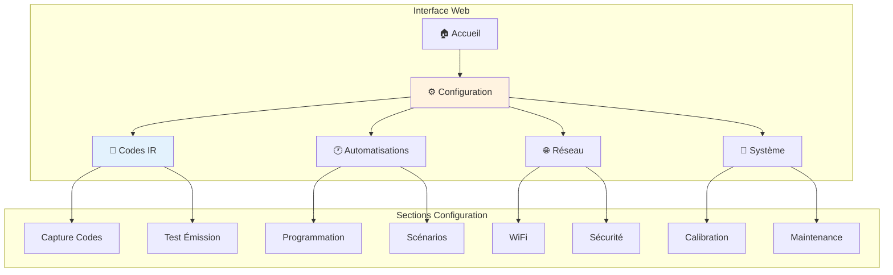
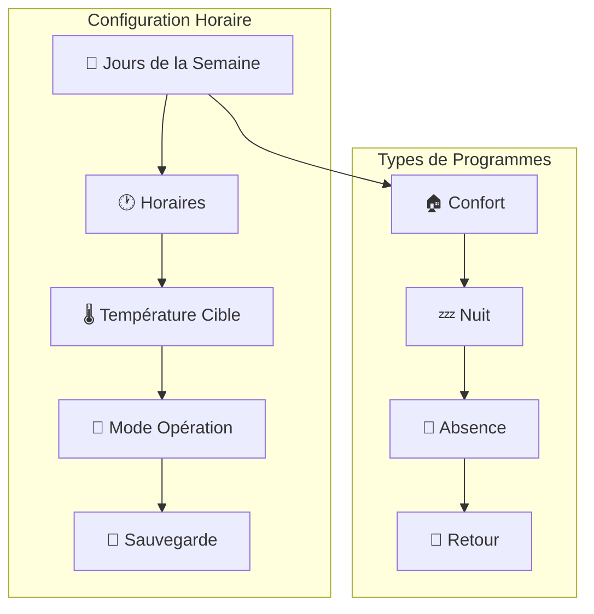

# Guide de Configuration - Système Thermopompe

## Vue d'Ensemble

Ce guide détaille la configuration complète du système de contrôle domotique après l'installation matérielle. Il couvre la configuration des codes IR pour la pompe Elios DE12HIW23230E3, le paramétrage des automatisations, la configuration réseau et la personnalisation des fonctions.

## Prérequis

- Installation matérielle terminée (voir [guide d'installation](installation.md))
- Module ESP32 fonctionnel et connecté au WiFi
- Accès à l'interface web du système
- Télécommande originale Elios DE12HIW23230E3 disponible

## Étape 1 : Accès à l'Interface de Configuration

### Connexion à l'Interface Web

```bash
# Méthodes d'accès
1. Par adresse IP : http://[IP_ESP32]
2. Par nom local : http://thermopompe-control.local
3. Mode configuration : http://192.168.4.1 (si en mode AP)
```

### Interface de Configuration


### Authentification
```json
{
  "default_credentials": {
    "username": "admin",
    "password": "thermopompe123"
  },
  "note": "Changez ces identifiants lors de la première connexion"
}
```

## Étape 2 : Configuration des Codes IR

### Capture des Codes de la Télécommande Originale

#### Mode Apprentissage
1. **Activation du mode capture**
   ```
   Navigation : Configuration → Codes IR → Mode Apprentissage
   ```

2. **Procédure de capture**
   ```mermaid
   sequenceDiagram
       participant U as Utilisateur
       participant W as Interface Web
       participant E as ESP32
       participant T as Télécommande
       
       U->>W: Active mode apprentissage
       W->>E: Démarre réception IR
       U->>T: Appuie sur bouton
       T->>E: Signal IR émis
       E->>W: Code capturé
       W->>U: Affiche code hexadécimal
   ```

#### Codes Standards Elios DE12HIW23230E3

**Codes de Base**
```json
{
  "elios_de12hiw23230e3": {
    "power_on": "0x10EF02FD",
    "power_off": "0x10EF827D",
    "timer_on": "0x10EF12ED",
    "timer_off": "0x10EF926D",
    "mode_heat": "0x10EF08F7",
    "mode_cool": "0x10EF8877",
    "mode_fan": "0x10EF48B7",
    "mode_auto": "0x10EF28D7",
    "temp_up": "0x10EF629D",
    "temp_down": "0x10EF42BD",
    "fan_speed": "0x10EF22DD",
    "led_toggle": "0x10EF52AD",
    "swing": "0x10EF32CD",
    "turbo": "0x10EF728D"
  }
}
```

**Codes Avancés (si disponibles)**
```json
{
  "advanced_codes": {
    "eco_mode": "0x10EFA25D",
    "sleep_mode": "0x10EF6A95",
    "follow_me": "0x10EFEA15",
    "ifeel": "0x10EF1AE5",
    "health": "0x10EF9A65",
    "8_heat": "0x10EF5AA5"
  }
}
```

### Configuration des Codes

#### Méthode 1 : Capture Automatique
```javascript
// Processus de capture automatique
const captureSequence = [
  "power_on", "power_off", "timer_on", "temp_up", "temp_down",
  "mode_heat", "mode_cool", "fan_speed", "led_toggle"
];

// Pour chaque fonction
captureSequence.forEach(function(button, index) {
  setTimeout(() => {
    showCapturePrompt(`Appuyez sur ${button} de la télécommande`);
  }, index * 5000);
});
```

#### Méthode 2 : Saisie Manuelle
```
Configuration → Codes IR → Saisie Manuelle
- Fonction : [Sélectionnez dans la liste]
- Code Hex : [Saisissez le code 0x...]
- Protocole : [NEC/Sony/RC5] (généralement NEC pour Elios)
- Bits : [32] (standard pour la plupart des codes)
```

### Test des Codes IR

#### Interface de Test
```html
<!-- Interface de test intégrée -->
<div class="ir-test-panel">
  <h3>Test des Codes IR</h3>
  <button onclick="testIR('power_on')">🔘 Power ON</button>
  <button onclick="testIR('timer_on')">⏰ Timer ON</button>
  <button onclick="testIR('temp_up')">🌡️ Temp +</button>
  <button onclick="testIR('temp_down')">🌡️ Temp -</button>
  <button onclick="testIR('led_toggle')">💡 LED Toggle</button>
</div>
```

#### Vérification de la Portée
```
Test de Portée IR :
1. Position à 1 mètre : ✅ Fonction attendue
2. Position à 3 mètres : ✅ Fonction attendue  
3. Position à 5 mètres : ✅ Fonction attendue
4. Position à 8 mètres : ⚠️ Tests requis
```

### Optimisation des Astuces Techniques

#### Configuration Power-On Silencieux
```json
{
  "silent_startup": {
    "avoid": "power_on",
    "use": "timer_on",
    "sequence": [
      {"command": "timer_on", "repeat": 2, "delay": 500},
      {"wait": 1800000, "comment": "Attendre 30 minutes"}
    ],
    "advantage": "Démarrage sans bip sonore"
  }
}
```

#### Configuration LED Toggle
```json
{
  "led_management": {
    "disable_beep": {
      "command": "led_toggle",
      "effect": "Désactive les notifications sonores",
      "recommended": true
    },
    "sequence_startup": [
      "timer_on",
      "led_toggle"
    ]
  }
}
```

## Étape 3 : Configuration des Automatisations

### Programmation Horaire

#### Interface de Programmation


#### Exemple de Configuration Hivernale
```json
{
  "winter_schedule": {
    "weekdays": {
      "06:30": {
        "action": "timer_on",
        "temperature": 21,
        "mode": "heat",
        "description": "Réveil - Préchauffage"
      },
      "08:00": {
        "action": "temp_down",
        "temperature": 19,
        "description": "Départ travail - Économie"
      },
      "17:30": {
        "action": "timer_on",
        "temperature": 21,
        "mode": "heat",
        "description": "Retour maison - Confort"
      },
      "22:00": {
        "action": "temp_down",
        "temperature": 18,
        "description": "Nuit - Économie"
      },
      "23:30": {
        "action": "power_off",
        "description": "Arrêt nocturne"
      }
    },
    "weekend": {
      "08:00": {
        "action": "timer_on",
        "temperature": 20,
        "mode": "heat",
        "description": "Réveil week-end"
      },
      "23:30": {
        "action": "power_off",
        "description": "Arrêt nocturne"
      }
    }
  }
}
```

#### Configuration des Scénarios

**Scénario 1 : Chauffage Économique**
```json
{
  "eco_heating": {
    "name": "Chauffage Économique",
    "trigger": "manual",
    "actions": [
      {"command": "led_toggle", "purpose": "Désactiver bip"},
      {"command": "timer_on", "repeat": 2},
      {"wait": 1800, "purpose": "Attendre démarrage"},
      {"command": "temp_down", "repeat": 3, "purpose": "Température réduite"}
    ],
    "target_temp": 19,
    "savings": "15-20%"
  }
}
```

**Scénario 2 : Confort Rapide**
```json
{
  "quick_comfort": {
    "name": "Confort Rapide",
    "trigger": "button",
    "actions": [
      {"command": "timer_on", "repeat": 2},
      {"wait": 1800},
      {"command": "temp_up", "repeat": 2},
      {"command": "turbo", "if_available": true}
    ],
    "target_temp": 22,
    "duration": "30min"
  }
}
```

### Automatisations Avancées

#### Basées sur les Capteurs
```json
{
  "sensor_automation": {
    "temperature_control": {
      "if": "sensor_temp < target_temp - 2",
      "then": "increase_heating",
      "else_if": "sensor_temp > target_temp + 1",
      "then": "decrease_heating"
    },
    "humidity_control": {
      "if": "humidity > 70",
      "then": "activate_dehumidify",
      "duration": "15min"
    }
  }
}
```

#### Intégration Météo (Optionnel)
```json
{
  "weather_integration": {
    "api_key": "votre_cle_api_meteo",
    "rules": [
      {
        "condition": "outdoor_temp < 0",
        "action": "preheat_30min_earlier"
      },
      {
        "condition": "sunny_day",
        "action": "reduce_heating_afternoon"
      }
    ]
  }
}
```

## Étape 4 : Configuration Réseau et Connectivité

### Configuration WiFi

#### Paramètres de Base
```json
{
  "wifi_config": {
    "ssid": "VotreReseauWiFi",
    "password": "VotreMotDePasse",
    "security": "WPA2/WPA3",
    "channel": "auto",
    "power_save": false,
    "reconnect_attempts": 5,
    "timeout": 30
  }
}
```

#### WiFi Backup (Réseau de Secours)
```json
{
  "backup_networks": [
    {
      "ssid": "WiFi_Principal",
      "password": "password1",
      "priority": 1
    },
    {
      "ssid": "WiFi_Invites",
      "password": "password2",
      "priority": 2
    },
    {
      "ssid": "Hotspot_Mobile",
      "password": "password3",
      "priority": 3
    }
  ]
}
```

### Configuration IP et Réseau

#### IP Statique (Recommandé)
```json
{
  "network_config": {
    "mode": "static",
    "ip": "192.168.1.100",
    "gateway": "192.168.1.1",
    "subnet": "255.255.255.0",
    "dns1": "8.8.8.8",
    "dns2": "8.8.4.4"
  }
}
```

#### DHCP Dynamique
```json
{
  "network_config": {
    "mode": "dhcp",
    "hostname": "thermopompe-control",
    "mac_address": "auto",
    "lease_time": 86400
  }
}
```

### Sécurité et Accès

#### Configuration des Utilisateurs
```json
{
  "users": {
    "admin": {
      "password": "nouveau_mot_de_passe_fort",
      "permissions": ["read", "write", "configure", "update"],
      "description": "Administrateur principal"
    },
    "user": {
      "password": "mot_de_passe_utilisateur",
      "permissions": ["read", "basic_control"],
      "description": "Utilisateur standard"
    },
    "guest": {
      "password": "mot_de_passe_invite",
      "permissions": ["read"],
      "description": "Accès lecture seule"
    }
  }
}
```

#### Configuration HTTPS (Optionnel)
```json
{
  "security": {
    "https_enabled": true,
    "certificate_path": "/certs/server.crt",
    "private_key_path": "/certs/server.key",
    "force_https": true,
    "hsts_enabled": true
  }
}
```

## Étape 5 : Personnalisation des Fonctions

### Configuration Interface Utilisateur

#### Thèmes et Apparence
```css
/* Thème personnalisé */
.thermopompe-theme {
  --primary-color: #2196F3;
  --secondary-color: #FF9800;
  --success-color: #4CAF50;
  --warning-color: #FF5722;
  --background: #FAFAFA;
  --card-background: #FFFFFF;
}
```

#### Widgets Dashboard
```json
{
  "dashboard_widgets": [
    {
      "type": "temperature",
      "position": {"x": 0, "y": 0, "w": 2, "h": 