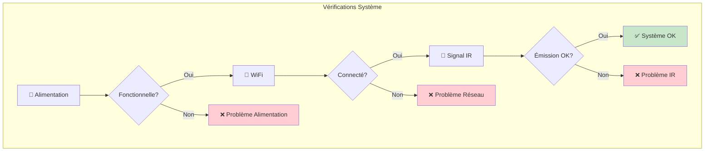
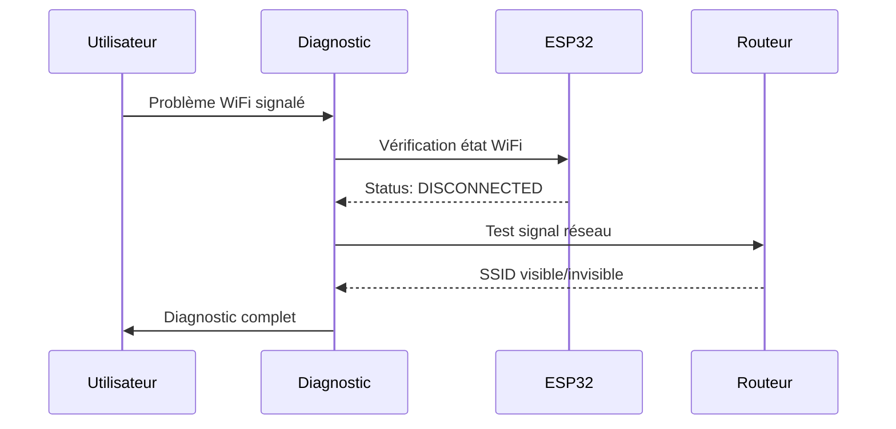
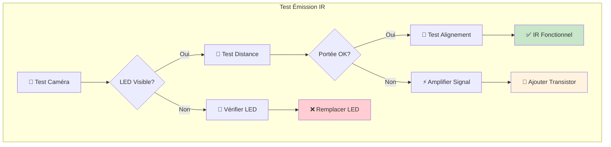
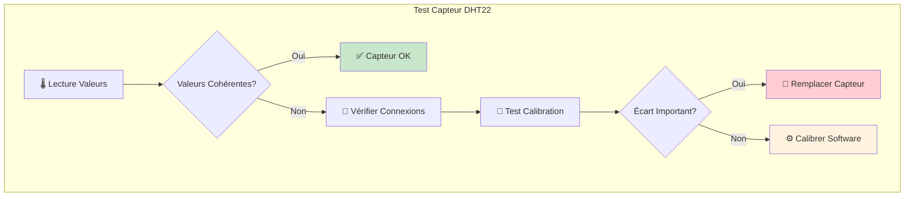

# Guide de Dépannage - Système Thermopompe

## Vue d'Ensemble

Ce guide présente les solutions aux problèmes les plus courants que vous pourriez rencontrer avec votre système de contrôle domotique Thermopompe. Il comprend le diagnostic des problèmes, les codes d'erreur, les solutions étape par étape et les procédures de maintenance.

## Diagnostic Rapide

### Vérifications Préliminaires

#### Checklist de Base


#### Indicateurs Visuels
```json
{
  "indicateurs_led": {
    "esp32_led": {
      "allumee_fixe": "✅ Système démarré",
      "clignote_rapide": "⚠️ Connexion WiFi en cours",
      "clignote_lent": "⚠️ Mode configuration",
      "eteinte": "❌ Problème alimentation/firmware"
    },
    "led_ir": {
      "visible_camera": "✅ Émission IR fonctionnelle",
      "invisible_camera": "❌ LED IR défaillante"
    }
  }
}
```

## Problèmes de Connectivité

### Problème : WiFi Non Connecté

#### Symptômes
- Interface web inaccessible
- Ping de l'ESP32 sans réponse
- LED clignote rapidement de façon continue

#### Diagnostic Étape par Étape


#### Solutions

**Solution 1 : Vérification Réseau**
```bash
# 1. Vérifier la disponibilité du réseau WiFi
# Depuis un autre appareil :
ping 192.168.1.1  # Tester la passerelle
iwconfig         # Voir les réseaux disponibles (Linux)
netsh wlan show profiles  # Voir les profils WiFi (Windows)

# 2. Vérifier les paramètres réseau
Fréquence : 2.4GHz uniquement (pas 5GHz)
Sécurité  : WPA2/WPA3 supporté
Canal     : Automatique ou 1,6,11
```

**Solution 2 : Reset Configuration WiFi**
```cpp
// Mode de récupération réseau
1. Maintenir le bouton BOOT de l'ESP32 pendant 10 secondes
2. L'ESP32 démarre en mode AP (Point d'Accès)
3. Connecter à "Thermopompe-Setup" 
4. Naviguer vers 192.168.4.1
5. Reconfigurer les paramètres WiFi
```

**Solution 3 : Diagnostic Avancé**
```json
{
  "tests_reseau": {
    "force_signal": {
      "excellent": "> -50 dBm",
      "bon": "-50 à -60 dBm", 
      "acceptable": "-60 à -70 dBm",
      "faible": "< -70 dBm (problématique)"
    },
    "test_commandes": [
      "ping 8.8.8.8",
      "nslookup google.com",
      "traceroute 192.168.1.1"
    ]
  }
}
```

### Problème : Connexion Intermittente

#### Symptômes
- Déconnexions fréquentes
- Interface web qui se fige
- Commandes qui n'arrivent pas toujours

#### Solutions
```json
{
  "optimisations_connexion": {
    "position_esp32": "Rapprocher du routeur WiFi",
    "obstacles": "Éviter murs épais, micro-ondes",
    "canal_wifi": "Changer de canal (1, 6 ou 11)",
    "puissance_signal": "Ajouter répéteur WiFi si nécessaire",
    "alimentation": "Vérifier stabilité 5V",
    "firmware": "Mettre à jour si disponible"
  }
}
```

## Problèmes Infrarouge (IR)

### Problème : Pompe Ne Répond Pas aux Commandes

#### Diagnostic IR


#### Solutions IR

**Solution 1 : Vérification de Base**
```bash
# Test avec smartphone
1. Ouvrir l'app caméra du téléphone
2. Pointer vers la LED IR de l'ESP32
3. Déclencher une commande depuis l'interface
4. Observer : LED doit clignoter (lumière blanche/violette)

# Si invisible :
- Vérifier connexions LED IR
- Contrôler résistance de limitation (220Ω)
- Tester avec multimètre
```

**Solution 2 : Optimisation Portée**
```cpp
// Code d'amplification IR
#define IR_SEND_PIN 4
#define IR_POWER_PIN 2  // Pin pour transistor d'amplification

void setupIR() {
  pinMode(IR_POWER_PIN, OUTPUT);
  digitalWrite(IR_POWER_PIN, HIGH);  // Alimenter transistor
  
  // Configuration émetteur haute puissance
  irsend.begin();
  irsend.enableIROut(38);  // Fréquence 38kHz
}

void sendCommand(uint32_t code) {
  // Répéter la commande pour fiabilité
  for(int i = 0; i < 3; i++) {
    irsend.sendNEC(code, 32);
    delay(100);
  }
}
```

**Solution 3 : Positionnement Optimal**
```json
{
  "positionnement_ir": {
    "distance": "3-8 mètres maximum",
    "angle": "±30° par rapport à l'axe direct",
    "obstacles": "Aucun objet entre émetteur et récepteur",
    "hauteur": "Même niveau que récepteur pompe",
    "environnement": "Éviter lumière directe du soleil"
  }
}
```

### Problème : Codes IR Incorrects

#### Symptômes
- Pompe réagit bizarrement
- Fonctions différentes de celles attendues
- Certaines commandes ne marchent pas

#### Re-capture des Codes
```cpp
// Procédure de re-capture
void recaptureIRCodes() {
  Serial.println("Mode capture activé");
  Serial.println("Pointez la télécommande et appuyez sur les boutons...");
  
  IRrecv irrecv(IR_RECV_PIN);
  decode_results results;
  
  irrecv.enableIRIn();
  
  while(true) {
    if (irrecv.decode(&results)) {
      Serial.printf("Code capturé: 0x%08X\n", results.value);
      Serial.printf("Protocole: %s\n", typeToString(results.decode_type));
      Serial.printf("Bits: %d\n", results.bits);
      
      irrecv.resume();
      delay(1000);
    }
  }
}
```

## Problèmes de Capteurs

### Problème : Lectures de Température Erronées

#### Diagnostic Capteurs


#### Solutions Capteurs

**Solution 1 : Test du DHT22**
```cpp
// Code de test capteur
#include <DHT.h>
#define DHT_PIN 18
#define DHT_TYPE DHT22

DHT dht(DHT_PIN, DHT_TYPE);

void testDHT22() {
  float temp = dht.readTemperature();
  float humidity = dht.readHumidity();
  
  if (isnan(temp) || isnan(humidity)) {
    Serial.println("❌ Erreur lecture capteur");
    Serial.println("Vérifier : connexions, alimentation, résistance pull-up");
  } else {
    Serial.printf("🌡️ Température : %.1f°C\n", temp);
    Serial.printf("💧 Humidité : %.1f%%\n", humidity);
    
    // Vérifications de cohérence
    if(temp < -40 || temp > 80) {
      Serial.println("⚠️ Température hors limites");
    }
    if(humidity < 0 || humidity > 100) {
      Serial.println("⚠️ Humidité hors limites");
    }
  }
}
```

**Solution 2 : Calibration**
```json
{
  "calibration_capteur": {
    "offset_temperature": "+0.5",
    "offset_humidity": "-2.0",
    "reference": "Thermomètre de référence",
    "methode": "Moyenne sur 24h",
    "formule": "valeur_calibree = valeur_brute + offset"
  }
}
```

## Codes d'Erreur Système

### Codes d'Erreur ESP32

#### Codes de Démarrage
```json
{
  "codes_erreur": {
    "E001": {
      "description": "Échec initialisation WiFi",
      "solution": "Vérifier paramètres réseau",
      "action": "Reset configuration WiFi"
    },
    "E002": {
      "description": "Capteur DHT22 non détecté",
      "solution": "Vérifier connexions capteur",
      "action": "Contrôler câblage GPIO18"
    },
    "E003": {
      "description": "Mémoire insuffisante",
      "solution": "Redémarrer l'ESP32",
      "action": "Power cycle complet"
    },
    "E004": {
      "description": "Erreur sauvegarde configuration",
      "solution": "Format mémoire interne",
      "action": "Factory reset"
    },
    "E005": {
      "description": "Module IR non fonctionnel",
      "solution": "Vérifier LED IR et connexions",
      "action": "Test hardware complet"
    }
  }
}
```

#### Interprétation des Messages
```cpp
// Gestion des codes d'erreur
void handleError(int errorCode, String errorMessage) {
  switch(errorCode) {
    case 1:  // E001 - WiFi
      Serial.println("🔴 Erreur WiFi - Tentative reconnexion...");
      WiFi.reconnect();
      break;
      
    case 2:  // E002 - DHT22
      Serial.println("🔴 Capteur DHT22 - Vérification connexions...");
      testDHT22();
      break;
      
    case 3:  // E003 - Mémoire
      Serial.println("🔴 Mémoire faible - Redémarrage recommandé");
      ESP.restart();
      break;
      
    default:
      Serial.printf("🔴 Erreur inconnue: %d - %s\n", errorCode, errorMessage.c_str());
  }
}
```

## FAQ Technique

### Questions Fréquentes

#### Q1 : La pompe émet toujours un bip lors du démarrage
```json
{
  "reponse": {
    "probleme": "Utilisation de 'Power ON' au lieu de 'Timer ON'",
    "solution": "Utiliser exclusivement le bouton 'Timer 30min'",
    "explication": "Le Timer ON évite le bip sonore de démarrage",
    "sequence": "Double-clic Timer → Attente 30min → Démarrage silencieux"
  }
}
```

#### Q2 : L'interface web est lente
```json
{
  "optimisations": {
    "signal_wifi": "Vérifier force signal (-60dBm minimum)",
    "navigateur": "Vider cache, utiliser Chrome/Firefox récent",
    "esp32": "Redémarrer module si uptime > 30 jours",
    "reseau": "Vérifier bande passante disponible"
  }
}
```

#### Q3 : Les automatisations ne se déclenchent pas
```json
{
  "verifications": {
    "heure_systeme": "Synchronisation NTP correcte",
    "programmation": "Horaires configurés et activés",
    "mode_systeme": "Mode automatique activé",
    "codes_ir": "Codes IR fonctionnels et testés"
  }
}
```

#### Q4 : Consommation énergétique élevée
```json
{
  "analyse": {
    "temperature_cible": "Réduire de 1-2°C",
    "programmation": "Optimiser plages horaires",
    "isolation": "Vérifier isolation thermique",
    "entretien": "Nettoyer filtres pompe