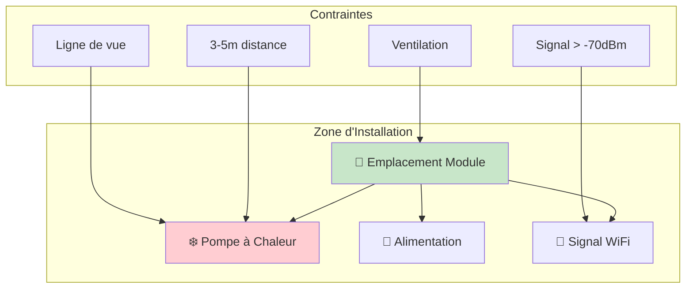
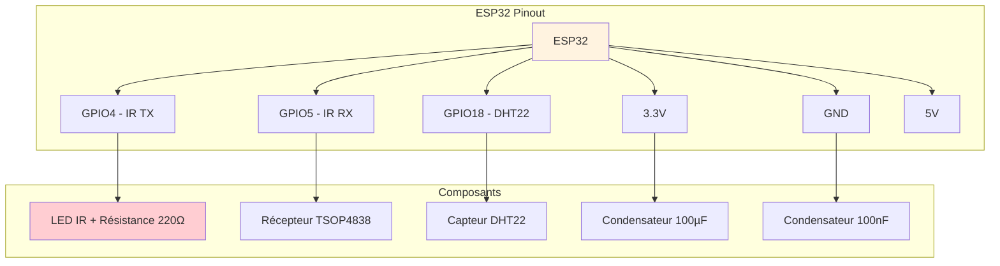
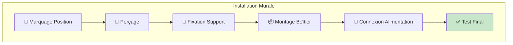

# Guide d'Installation - Système Thermopompe

## Vue d'Ensemble

Ce guide détaille l'installation complète du système de contrôle domotique pour votre pompe à chaleur Elios DE12HIW23230E3. L'installation comprend l'assemblage du matériel, le câblage, la configuration initiale et les tests de fonctionnement.

## Prérequis

### Prérequis Système
- **Réseau WiFi domestique** : 2.4GHz (WPA2/WPA3)
- **Signal WiFi** : Force suffisante à l'emplacement d'installation
- **Alimentation électrique** : Prise 5V disponible près de la pompe
- **Pompe à chaleur** : Elios DE12HIW23230E3 fonctionnelle

### Prérequis Matériel
Vérifiez que vous disposez de tous les composants listés dans le [guide matériel](../guide-technique/guide-materiel.md) :
- Module ESP32
- LED infrarouge TSAL6400 ou équivalent
- Récepteur IR TSOP4838
- Résistances (220Ω, 10kΩ)
- Condensateurs (100µF, 100nF)
- Breadboard ou PCB
- Câbles de connexion
- Boîtier de protection
- Alimentation 5V

### Prérequis Techniques
- **Connaissances de base** : Électronique et soudure
- **Outils requis** :
  - Fer à souder (25-40W)
  - Multimètre
  - Tournevis de précision
  - Ordinateur pour la programmation

## Étape 1 : Préparation de l'Espace

### Choix de l'Emplacement
1. **Distance optimale** : 3-5 mètres de la pompe à chaleur
2. **Ligne de vue directe** : Aucun obstacle entre l'émetteur et le récepteur IR
3. **Accès réseau** : Signal WiFi stable (minimum -70 dBm)
4. **Alimentation** : Prise électrique accessible
5. **Ventilation** : Éviter les espaces confinés

### Sécurité
⚠️ **ATTENTION** : Coupez l'alimentation électrique avant toute manipulation



## Étape 2 : Assemblage du Circuit

### Schéma de Câblage Principal



### Câblage Détaillé

#### Émetteur IR (LED Infrarouge)
```
ESP32 GPIO4 → Résistance 220Ω → Anode LED IR
Cathode LED IR → GND ESP32
```

#### Récepteur IR (TSOP4838)
```
TSOP4838 VCC → 3.3V ESP32
TSOP4838 GND → GND ESP32
TSOP4838 OUT → GPIO5 ESP32
```

#### Capteur Température/Humidité (DHT22)
```
DHT22 VCC → 3.3V ESP32
DHT22 GND → GND ESP32
DHT22 DATA → GPIO18 ESP32
Résistance 10kΩ entre VCC et DATA (pull-up)
```

#### Alimentation et Stabilisation
```
Alimentation 5V → VIN ESP32
Condensateur 100µF entre VIN et GND
Condensateur 100nF entre 3.3V et GND
```

### Assemblage Étape par Étape

1. **Préparation de la breadboard**
   ```bash
   # Disposition recommandée sur breadboard 830 points
   Rangée 1-10  : Alimentation (VCC/GND)
   Rangée 15-25 : ESP32
   Rangée 30-35 : Composants IR
   Rangée 40-45 : Capteurs
   ```

2. **Installation de l'ESP32**
   - Placez l'ESP32 au centre de la breadboard
   - Vérifiez l'alignement des broches
   - Ne forcez pas l'insertion

3. **Câblage de l'alimentation**
   - Connectez les rails d'alimentation
   - Ajoutez les condensateurs de stabilisation
   - Testez avec un multimètre

4. **Installation des composants IR**
   - Soudez la résistance 220Ω en série avec la LED IR
   - Respectez la polarité de la LED (anode = plus long)
   - Installez le récepteur TSOP4838

5. **Ajout des capteurs**
   - Connectez le DHT22 avec résistance pull-up
   - Vérifiez toutes les connexions

## Étape 3 : Programmation du Module

### Installation de l'Environnement de Développement

#### Arduino IDE
```bash
# 1. Téléchargez Arduino IDE depuis arduino.cc
# 2. Ajoutez le support ESP32
URL : https://dl.espressif.com/dl/package_esp32_index.json
```

#### Bibliothèques Requises
```cpp
// Bibliothèques à installer via le gestionnaire
#include <WiFi.h>              // WiFi ESP32 (préinstallé)
#include <IRremoteESP8266.h>   // Contrôle IR
#include <DHT.h>               // Capteur température/humidité
#include <ArduinoJson.h>       // Gestion JSON
#include <AsyncWebServer.h>    // Serveur web asynchrone
```

### Configuration des Paramètres

#### Fichier de Configuration (config.h)
```cpp
// Configuration WiFi
#define WIFI_SSID "VotreReseauWiFi"
#define WIFI_PASSWORD "VotreMotDePasse"

// Configuration IR
#define IR_SEND_PIN 4
#define IR_RECV_PIN 5

// Configuration Capteurs
#define DHT_PIN 18
#define DHT_TYPE DHT22

// Configuration Réseau
#define HTTP_PORT 80
#define DEVICE_NAME "Thermopompe-Control"
```

### Code Principal (Exemple Minimal)
```cpp
#include <WiFi.h>
#include <IRremoteESP8266.h>
#include <IRsend.h>
#include <DHT.h>

// Initialisation
IRsend irsend(IR_SEND_PIN);
DHT dht(DHT_PIN, DHT_TYPE);

void setup() {
  Serial.begin(115200);
  
  // Configuration IR
  irsend.begin();
  
  // Configuration capteurs
  dht.begin();
  
  // Configuration WiFi
  WiFi.begin(WIFI_SSID, WIFI_PASSWORD);
  while (WiFi.status() != WL_CONNECTED) {
    delay(1000);
    Serial.println("Connexion WiFi...");
  }
  
  Serial.println("Installation réussie !");
  Serial.print("IP: ");
  Serial.println(WiFi.localIP());
}

void loop() {
  // Boucle principale
  delay(1000);
}
```

## Étape 4 : Configuration Initiale

### Première Mise sous Tension
1. **Vérification des connexions**
   - Double-vérifiez tous les câblages
   - Utilisez un multimètre pour tester la continuité
   - Vérifiez les polarités

2. **Alimentation du système**
   - Connectez l'alimentation 5V
   - Observez les LED de statut de l'ESP32
   - Vérifiez les tensions avec un multimètre

3. **Test de démarrage**
   - Ouvrez le moniteur série (115200 bauds)
   - Observez les messages de démarrage
   - Vérifiez la connexion WiFi

### Configuration Réseau
```bash
# Étapes de configuration WiFi
1. L'ESP32 démarre en mode AP (Point d'Accès)
2. Connectez-vous au réseau "Thermopompe-Setup"
3. Ouvrez 192.168.4.1 dans votre navigateur
4. Saisissez vos paramètres WiFi
5. Redémarrez le module
```

## Étape 5 : Tests de Fonctionnement

### Test 1 : Connectivité WiFi
```bash
# Vérifications réseau
ping [adresse_IP_ESP32]
# Réponse attendue : réception des paquets

# Test interface web
http://[adresse_IP_ESP32]
# Réponse attendue : page de contrôle
```

### Test 2 : Émission IR
```cpp
// Code de test émission IR
void testIR() {
  // Signal test pour Elios DE12HIW23230E3
  uint16_t rawData[67] = {9000, 4500, 560, 560, 560, 1690, 560, 560, /* ... */};
  irsend.sendRaw(rawData, 67, 38);
  Serial.println("Signal IR envoyé");
}
```

**Vérification visuelle** :
- Utilisez la caméra d'un smartphone
- La LED IR doit être visible lors de l'émission
- Distance recommandée : 1-2 mètres pour les tests

### Test 3 : Réception IR
1. **Capture des codes de la télécommande originale**
   ```cpp
   // Mode capture activé
   // Pointez la télécommande vers le récepteur
   // Pressez les boutons un par un
   // Notez les codes reçus
   ```

2. **Codes Elios DE12HIW23230E3 typiques**
   ```
   Power ON    : 0x10EF02FD
   Power OFF   : 0x10EF827D
   Timer ON    : 0x10EF12ED
   Temp +      : 0x10EF629D
   Temp -      : 0x10EF42BD
   LED Toggle  : 0x10EF52AD
   ```

### Test 4 : Capteurs
```cpp
// Test lecture capteurs
void testSensors() {
  float temperature = dht.readTemperature();
  float humidity = dht.readHumidity();
  
  if (!isnan(temperature) && !isnan(humidity)) {
    Serial.printf("Temp: %.1f°C, Humidité: %.1f%%\n", temperature, humidity);
  } else {
    Serial.println("Erreur lecture capteurs");
  }
}
```

### Test 5 : Communication avec la Pompe
1. **Test de base**
   - Envoyez une commande simple (LED toggle)
   - Observez la réponse de la pompe
   - Vérifiez l'absence de bip si utilisation du Timer

2. **Test de portée**
   - Testez à différentes distances (1m, 3m, 5m)
   - Vérifiez la fiabilité des commandes
   - Ajustez l'orientation si nécessaire

## Étape 6 : Installation Finale

### Montage dans le Boîtier
1. **Préparation du boîtier**
   - Percez les ouvertures pour les LED IR
   - Ajoutez une grille de ventilation
   - Préparez les fixations

2. **Installation des composants**
   - Transférez le circuit sur PCB définitif
   - Soudez tous les composants
   - Testez une dernière fois avant fermeture

3. **Assemblage final**
   - Placez le circuit dans le boîtier
   - Connectez l'alimentation
   - Fermez et scellez le boîtier

### Fixation Murale


## Dépannage Installation

### Problèmes Courants

**ESP32 ne démarre pas**
- Vérifiez l'alimentation (5V, 500mA min)
- Contrôlez les connexions GND
- Testez sans les composants externes

**WiFi ne se connecte pas**
- Vérifiez le nom et mot de passe du réseau
- Assurez-vous que le réseau est en 2.4GHz
- Vérifiez la force du signal

**LED IR ne fonctionne pas**
- Contrôlez la polarité de la LED
- Vérifiez la résistance de limitation
- Testez avec une caméra de smartphone

**Pompe ne répond pas**
- Vérifiez l'alignement IR
- Testez la portée (déplacez plus près)
- Contrôlez les codes IR utilisés

**Capteurs ne fonctionnent pas**
- Vérifiez l'alimentation des capteurs
- Contrôlez les connexions de données
- Testez avec un code simple

### Tests de Diagnostic

#### Test d'Alimentation
```bash
# Mesures multimètre
VIN ESP32     : 5.0V ±0.2V
3.3V ESP32    : 3.3V ±0.1V
Consommation  : 80-150mA normal
```

#### Test de Communication
```bash
# Ping réseau
ping -t [IP_ESP32]
# Doit répondre en <5ms

# Test HTTP
curl http://[IP_ESP32]/status
# Doit retourner JSON valide
```

#### Test IR Avancé
```cpp
// Test avec oscilloscope ou analyseur logique
// Signal IR à 38kHz avec modulation correcte
// Durée des