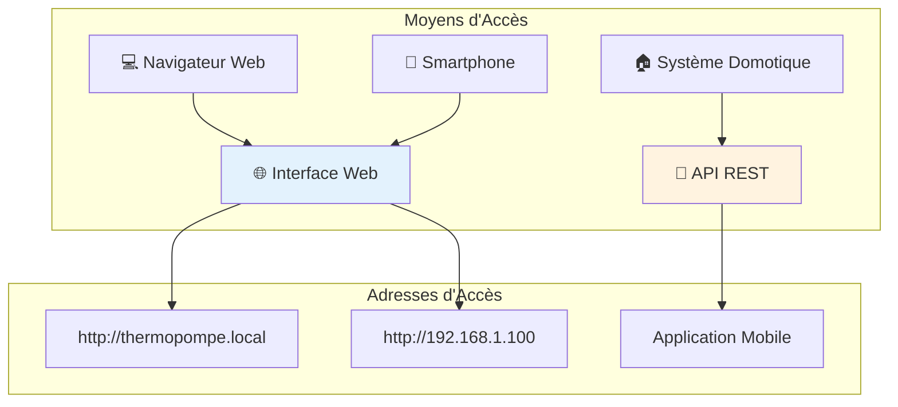
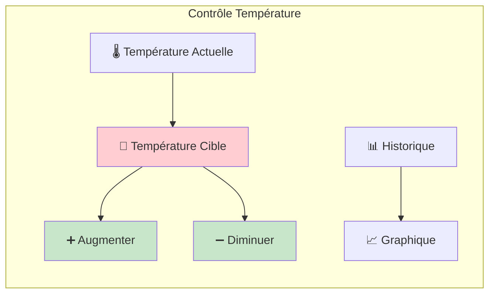
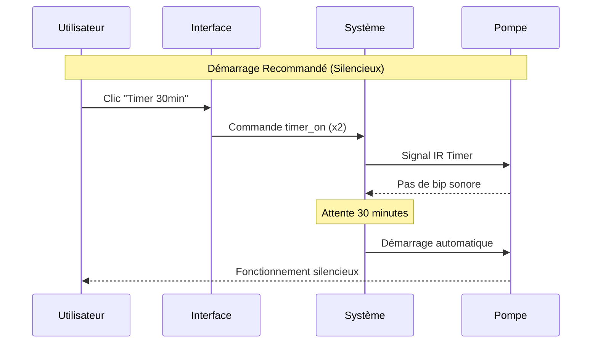
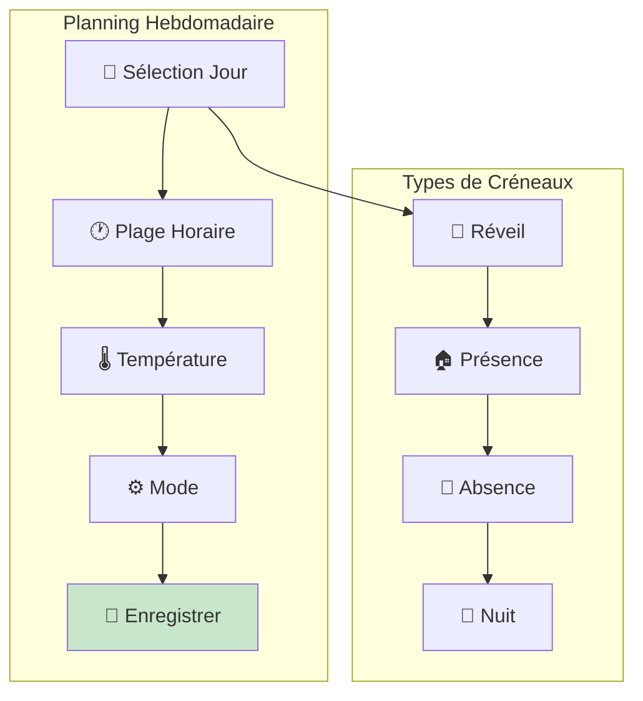
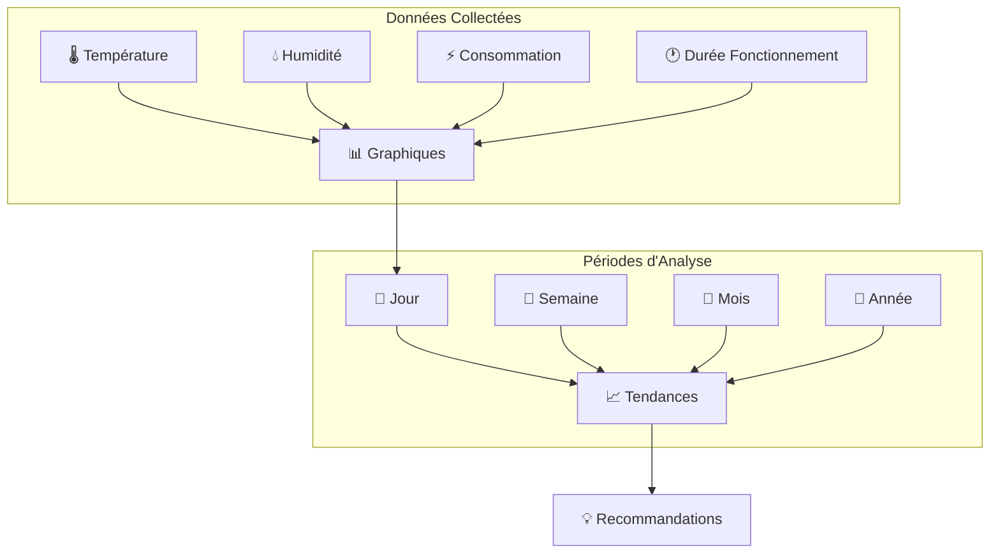
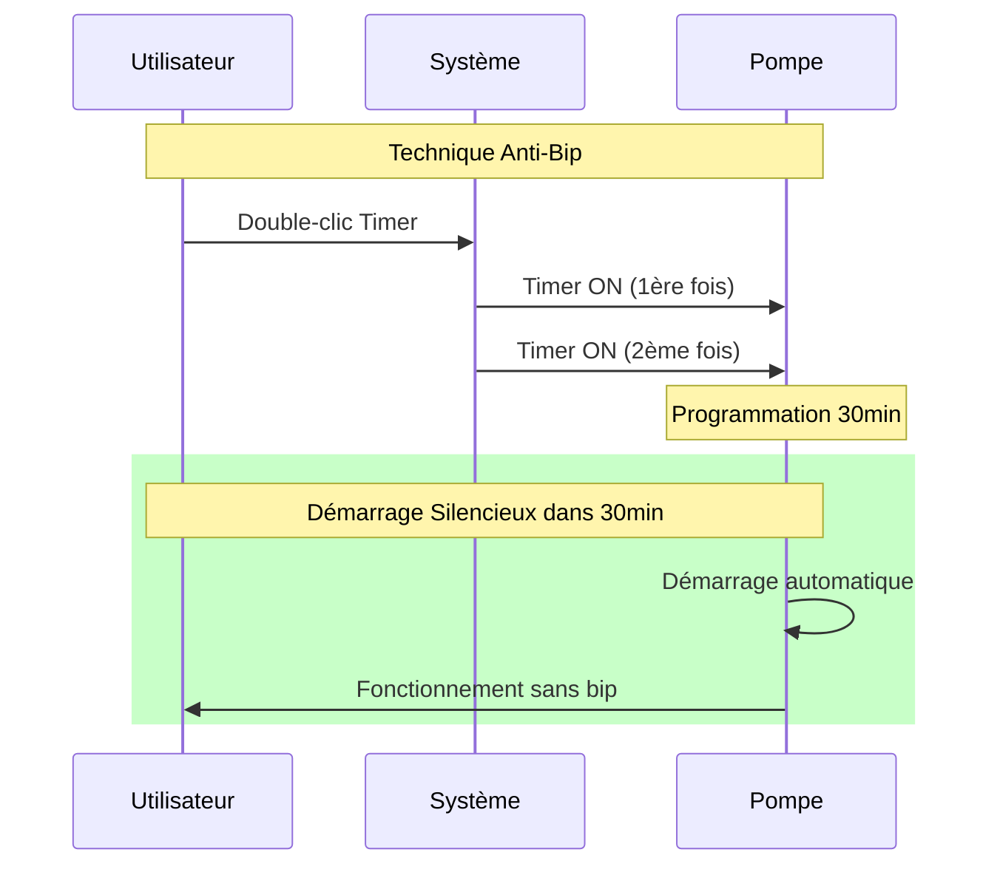

# Guide d'Utilisation - Système Thermopompe

## Vue d'Ensemble

Ce guide détaille l'utilisation quotidienne du système de contrôle domotique pour votre pompe à chaleur Elios DE12HIW23230E3. Il couvre l'interface utilisateur, les fonctionnalités, l'utilisation des automatisations, et les astuces d'optimisation.

## Prérequis

- Installation matérielle terminée (voir [guide d'installation](installation.md))
- Configuration système complétée (voir [guide de configuration](configuration.md))
- Accès réseau WiFi fonctionnel
- Codes IR configurés et testés

## Interface Utilisateur

### Accès au Système

#### Méthodes de Connexion


#### Interface Web Principale
```html
<!-- Structure de l'interface -->
<div class="dashboard">
  <header class="top-bar">
    <h1>🌡️ Thermopompe Control</h1>
    <div class="status-indicators">
      <span class="wifi-status">📶 WiFi</span>
      <span class="pump-status">❄️ Pompe</span>
    </div>
  </header>
  
  <main class="control-panel">
    <section class="temperature-control">
      <div class="current-temp">21.5°C</div>
      <div class="target-temp">22°C</div>
      <div class="temp-controls">
        <button class="temp-down">-</button>
        <button class="temp-up">+</button>
      </div>
    </section>
    
    <section class="mode-control">
      <button class="mode heat active">🔥 Chauffage</button>
      <button class="mode cool">❄️ Refroidissement</button>
      <button class="mode fan">💨 Ventilation</button>
    </section>
    
    <section class="quick-actions">
      <button class="power">⚡ Marche/Arrêt</button>
      <button class="timer">⏰ Timer 30min</button>
      <button class="silent">🔇 Mode Silencieux</button>
    </section>
  </main>
</div>
```

### Panneau de Contrôle Principal

#### Zone de Température


**Utilisation :**
- **Température actuelle** : Affichage en temps réel via capteur DHT22
- **Température cible** : Valeur souhaitée (réglable 16-30°C)
- **Boutons +/-** : Ajustement par paliers de 1°C
- **Double-clic** : Ajustement rapide (±3°C)

#### Zone de Modes
```json
{
  "modes_operation": {
    "heat": {
      "icon": "🔥",
      "description": "Chauffage",
      "color": "#FF5722",
      "temp_range": "16-30°C"
    },
    "cool": {
      "icon": "❄️",
      "description": "Refroidissement", 
      "color": "#2196F3",
      "temp_range": "16-30°C"
    },
    "fan": {
      "icon": "💨",
      "description": "Ventilation seule",
      "color": "#4CAF50",
      "temp_range": "N/A"
    },
    "auto": {
      "icon": "🔄",
      "description": "Automatique",
      "color": "#FF9800",
      "temp_range": "18-25°C"
    }
  }
}
```

## Fonctionnalités Principales

### Contrôle Manuel

#### Démarrage de la Pompe


**Méthodes de Démarrage :**

1. **Mode Timer (Recommandé)**
   ```
   Action : Cliquer "Timer 30min"
   Avantage : Démarrage silencieux
   Délai : 30 minutes
   Usage : Programmation anticipée
   ```

2. **Mode Direct**
   ```
   Action : Cliquer "Marche/Arrêt"
   Inconvénient : Émet un bip sonore
   Délai : Immédiat
   Usage : Situations d'urgence uniquement
   ```

#### Réglage de Température

**Interface de Réglage**
```html
<div class="temperature-adjuster">
  <button onclick="adjustTemp(-1)" class="temp-btn minus">
    ➖ -1°C
  </button>
  <div class="temp-display">
    <span class="current">21°C</span>
    <span class="target">→ 22°C</span>
  </div>
  <button onclick="adjustTemp(+1)" class="temp-btn plus">
    ➕ +1°C
  </button>
</div>
```

**Astuces de Réglage :**
- **Paliers recommandés** : Ajustements de 1-2°C maximum
- **Éviter les variations importantes** : La pompe consomme plus
- **Température de confort** : 20-22°C en hiver, 24-26°C en été
- **Température de nuit** : -2°C par rapport au jour

### Automatisations

#### Programmation Hebdomadaire

**Interface de Programmation**


**Exemple : Journée Type Hiver**
```json
{
  "journee_hiver": {
    "06:30": {
      "action": "Réveil - Préchauffage",
      "temperature": 21,
      "mode": "heat",
      "method": "timer_30min"
    },
    "08:30": {
      "action": "Départ - Économie",
      "temperature": 18,
      "mode": "heat"
    },
    "17:30": {
      "action": "Retour - Confort",
      "temperature": 21,
      "mode": "heat",
      "method": "timer_30min"
    },
    "22:30": {
      "action": "Nuit - Réduction",
      "temperature": 18,
      "mode": "heat"
    },
    "00:00": {
      "action": "Arrêt nocturne",
      "mode": "off"
    }
  }
}
```

#### Scénarios Prédéfinis

**Scénario 1 : Économie d'Énergie**
```json
{
  "scenario_economie": {
    "name": "Mode Économique",
    "description": "Optimise la consommation énergétique",
    "actions": [
      {
        "step": 1,
        "action": "Désactiver notifications sonores",
        "command": "led_toggle"
      },
      {
        "step": 2,
        "action": "Température réduite",
        "command": "temp_down",
        "repeat": 2
      },
      {
        "step": 3,
        "action": "Mode automatique",
        "command": "mode_auto"
      }
    ],
    "economies": "15-25%",
    "confort": "Légèrement réduit"
  }
}
```

**Scénario 2 : Confort Maximum**
```json
{
  "scenario_confort": {
    "name": "Confort Maximum",
    "description": "Optimise le confort thermique",
    "actions": [
      {
        "step": 1,
        "action": "Démarrage silencieux",
        "command": "timer_on",
        "repeat": 2
      },
      {
        "step": 2,
        "action": "Température optimale",
        "target_temp": 22
      },
      {
        "step": 3,
        "action": "Mode turbo si disponible",
        "command": "turbo"
      }
    ],
    "confort": "Maximum",
    "consommation": "Élevée"
  }
}
```

### Surveillance et Monitoring

#### Tableau de Bord Temps Réel
```html
<div class="monitoring-dashboard">
  <div class="sensor-card temperature">
    <h3>🌡️ Température</h3>
    <div class="value">21.5°C</div>
    <div class="trend">↗️ +0.5°C/h</div>
  </div>
  
  <div class="sensor-card humidity">
    <h3>💧 Humidité</h3>
    <div class="value">45%</div>
    <div class="status">✅ Optimal</div>
  </div>
  
  <div class="sensor-card power">
    <h3>⚡ Consommation</h3>
    <div class="value">1.2 kW</div>
    <div class="cost">~0.18€/h</div>
  </div>
  
  <div class="sensor-card system">
    <h3>🔧 Système</h3>
    <div class="status">🟢 En ligne</div>
    <div class="uptime">Uptime: 15j 6h</div>
  </div>
</div>
```

#### Historiques et Statistiques


## Astuces d'Utilisation

### Optimisation du Confort

#### Gestion des Températures
```json
{
  "temperatures_optimales": {
    "hiver": {
      "jour_presence": "20-21°C",
      "jour_absence": "17-18°C", 
      "nuit": "16-18°C",
      "reveil": "21-22°C"
    },
    "ete": {
      "jour_presence": "24-26°C",
      "jour_absence": "27-28°C",
      "nuit": "25-26°C"
    },
    "mi_saison": {
      "conseil": "Utiliser mode ventilation uniquement",
      "temperature": "18-20°C"
    }
  }
}
```

#### Technique du Timer (Astuce Principale)


**Avantages de la Technique Timer :**
- ✅ Aucun bip sonore gênant
- ✅ Démarrage plus doux pour la pompe
- ✅ Anticipation possible (programmation)
- ✅ Économie d'énergie (démarrage progressif)

### Optimisation Énergétique

#### Stratégies d'Économie
```json
{
  "strategies_economie": {
    "programmation_intelligente": {
      "principe": "Adapter aux heures creuses",
      "economies": "20-30%",
      "methode": "Préchauffage en heures creuses"
    },
    "reduction_nocturne": {
      "principe": "Baisser de 3-4°C la nuit",
      "economies": "10-15%",
      "confort": "Impact minimal"
    },
    "absence_prolongee": {
      "principe": "Mode hors-gel uniquement",
      "economies": "50-70%",
      "temperature": "8-10°C"
    },
    "optimisation_zones": {
      "principe": "Chauffer seulement les zones occupées",
      "economies": "15-25%",
      "methode": "Fermeture pièces inoccupées"
    }
  }
}
```

#### Surveillance Consommation
```html
<div class="energy-monitoring">
  <h3>📊 Suivi Énergét