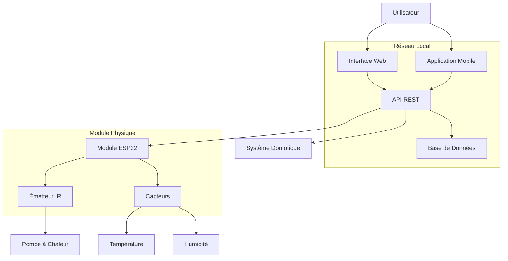
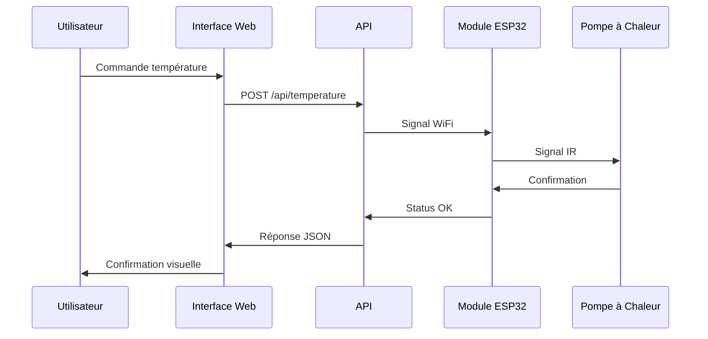

# Plan de Restructuration de la Documentation - Projet Thermopompe

## 1. Analyse de l'État Actuel

### Problèmes Identifiés
- **README.md** : Extrêmement minimal (2 lignes seulement)
- **hardware.md** : Bon contenu technique mais mélange français/anglais et formatage inconsistant
- **architecture.MD** : Quasi-vide (1 mot)
- **Incohérences** : Extensions de fichiers (.md vs .MD), langues mélangées
- **Manques critiques** : Installation, configuration, API, dépannage, diagrammes

## 2. Structure Documentaire Cible

```
Thermopompe/
├── README.md                          # Point d'entrée principal
├── CHANGELOG.md                       # Historique des versions
├── CONTRIBUTING.md                    # Guide de contribution
├── LICENSE                            # Licence du projet
├── docs/                              # Documentation complète
│   ├── guide-utilisateur/
│   │   ├── README.md                  # Index du guide utilisateur
│   │   ├── installation.md            # Guide d'installation
│   │   ├── configuration.md           # Configuration du système
│   │   ├── utilisation.md            # Guide d'utilisation quotidien
│   │   └── depannage.md              # Guide de dépannage
│   ├── guide-technique/
│   │   ├── README.md                  # Index technique
│   │   ├── architecture.md            # Architecture système
│   │   ├── materiel.md               # Documentation matériel
│   │   ├── api.md                    # Documentation API
│   │   ├── protocoles.md             # Protocoles IR et communication
│   │   └── schemas/                  # Diagrammes et schémas
│   │       ├── architecture-systeme.md
│   │       ├── schema-electronique.md
│   │       └── diagramme-flux.md
│   └── ressources/
│       ├── references.md             # Références externes
│       ├── faq.md                   # Questions fréquentes
│       └── glossaire.md             # Glossaire technique
├── src/                              # Code source (futur)
├── hardware/                         # Fichiers CAD/schémas (futur)
└── tests/                           # Tests (futur)
```

## 3. Conventions de Standardisation

### Langue
- **Français exclusivement** pour toute la documentation
- Termes techniques en français avec équivalent anglais entre parenthèses lors de la première mention
- Exemple : "Infrarouge (IR)" puis "IR" par la suite

### Nommage des Fichiers
- **Extension** : `.md` uniquement (pas de `.MD`)
- **Format** : kebab-case (tirets) pour les noms composés
- **Exemples** : `guide-installation.md`, `schema-electronique.md`

### Structure Markdown
- **Titre principal** : Un seul H1 (#) par fichier
- **Hiérarchie** : H2 (##) pour les sections principales, H3 (###) pour les sous-sections
- **Liens internes** : Relatifs depuis la racine du projet
- **Images** : Stockées dans `docs/images/` avec noms descriptifs

## 4. Plan de Contenu Détaillé

### 4.1 README.md (Racine)
**Objectif** : Point d'entrée accueillant et informatif
**Contenu** :
- Description concise du projet (2-3 phrases)
- Fonctionnalités principales
- Prérequis système
- Installation rapide (lien vers guide détaillé)
- Liens vers documentation complète
- État du projet et roadmap
- Informations de contribution et licence

### 4.2 docs/guide-utilisateur/

#### installation.md
- Prérequis matériels et logiciels
- Installation pas à pas
- Vérification de l'installation
- Dépannage installation

#### configuration.md
- Configuration initiale
- Paramétrage de la pompe à chaleur
- Configuration réseau WiFi
- Personnalisation avancée

#### utilisation.md
- Interface utilisateur
- Commandes de base
- Scénarios d'usage
- Bonnes pratiques

#### depannage.md
- Problèmes courants et solutions
- Diagnostic automatisé
- Logs et débogage
- Support et contact

### 4.3 docs/guide-technique/

#### architecture.md
- Vue d'ensemble du système
- Composants principaux
- Flux de données
- Diagrammes d'architecture

#### materiel.md (refonte de hardware.md actuel)
- Liste complète des composants
- Spécifications techniques
- Schémas de câblage
- Alternatives et recommandations

#### api.md
- Endpoints disponibles
- Authentification
- Exemples de requêtes/réponses
- Codes d'erreur

#### protocoles.md
- Protocole infrarouge
- Communication WiFi
- Sécurité et chiffrement
- Interopérabilité

### 4.4 docs/guide-technique/schemas/

#### architecture-systeme.md
- Diagramme d'architecture global
- Interactions entre composants
- Flux de contrôle

#### schema-electronique.md
- Schémas de circuits
- PCB layout (si applicable)
- Spécifications électriques

#### diagramme-flux.md
- Processus de contrôle
- États du système
- Gestion d'erreurs

## 5. Priorités de Développement

### Phase 1 - Fondations (Semaine 1)
1. **README.md** - Créer point d'entrée professionnel
2. **docs/guide-technique/materiel.md** - Nettoyer et enrichir hardware.md existant
3. **docs/guide-technique/architecture.md** - Créer architecture système de base

### Phase 2 - Guides Utilisateur (Semaine 2)
4. **docs/guide-utilisateur/installation.md** - Guide installation complet
5. **docs/guide-utilisateur/configuration.md** - Configuration initiale
6. **docs/guide-utilisateur/depannage.md** - Solutions problèmes courants

### Phase 3 - Documentation Technique (Semaine 3)
7. **docs/guide-technique/api.md** - Documentation API
8. **docs/guide-technique/protocoles.md** - Protocoles de communication
9. **docs/guide-technique/schemas/** - Diagrammes et schémas

### Phase 4 - Finitions (Semaine 4)
10. **docs/ressources/** - FAQ, glossaire, références
11. **CONTRIBUTING.md** - Guide de contribution
12. **Révision générale** - Cohérence et liens croisés

## 6. Templates/Structures Suggérés

### Template README Principal
```markdown
# Thermopompe - Contrôle Domotique IR

[Badge build] [Badge version] [Badge license]

## Description
Système de contrôle domotique pour remplacer la télécommande d'une pompe à chaleur par un module électronique connecté utilisant la technologie infrarouge.

## Fonctionnalités
- ✅ Contrôle infrarouge de la pompe à chaleur
- ✅ Interface web responsive
- ✅ API REST complète
- 🔄 Intégration domotique (Home Assistant, etc.)

## Installation Rapide
[Lien vers guide d'installation]

## Documentation
- [Guide d'installation](docs/guide-utilisateur/installation.md)
- [Guide d'utilisation](docs/guide-utilisateur/utilisation.md)
- [Documentation technique](docs/guide-technique/)

## État du Projet
🔨 En développement actif

## Contribution
[Lien vers CONTRIBUTING.md]

## Licence
[Licence du projet]
```

### Template Guide Technique
```markdown
# [Titre de la Section]

## Vue d'Ensemble
[Description générale]

## Prérequis
[Ce qu'il faut savoir/avoir avant]

## [Section Principale 1]
### Sous-section
[Contenu détaillé]

## Diagrammes
[Mermaid diagrams si applicable]

## Exemples
[Exemples pratiques]

## Références
- [Liens externes]
- [Documentation connexe]

## Dépannage
[Problèmes spécifiques à cette section]
```

## 7. Diagrammes d'Architecture Mermaid

### Diagramme d'Architecture Système


### Diagramme de Flux de Contrôle


## 8. Migration des Fichiers Existants

### Mapping des Fichiers Actuels
- `README.md` → Réécriture complète
- `hardware.md` → `docs/guide-technique/materiel.md` (traduction + enrichissement)
- `architecture.MD` → `docs/guide-technique/architecture.md` (création complète)

### Étapes de Migration
1. **Sauvegarde** : Créer branche backup des fichiers actuels
2. **Nettoyage** : Standardiser langue et formatage
3. **Enrichissement** : Ajouter contenu manquant
4. **Restructuration** : Déplacer vers nouvelle hiérarchie
5. **Validation** : Vérifier liens et cohérence

## 9. Outils et Ressources Recommandés

### Outils de Documentation
- **Éditeur** : VSCode avec extensions Markdown
- **Validation** : markdownlint pour cohérence
- **Diagrammes** : Mermaid pour schémas
- **Images** : Draw.io pour schémas complexes

### Ressources Référentielles
- Guide Markdown GitHub
- Conventions documentation technique
- Exemples projets IoT similaires

## 10. Critères de Succès

### Métriques Qualité
- ✅ Cohérence linguistique (100% français)
- ✅ Structure navigation intuitive
- ✅ Couverture complète (installation → dépannage)
- ✅ Diagrammes explicatifs présents
- ✅ Liens internes fonctionnels

### Tests d'Utilisabilité
- Nouveau utilisateur peut installer en <30min
- Problème technique résolu via documentation
- Architecture compréhensible par développeur externe

---

Ce plan constitue la feuille de route complète pour la restructuration de la documentation du projet Thermopompe, priorisant la cohérence, l'exhaustivité et l'utilisabilité.